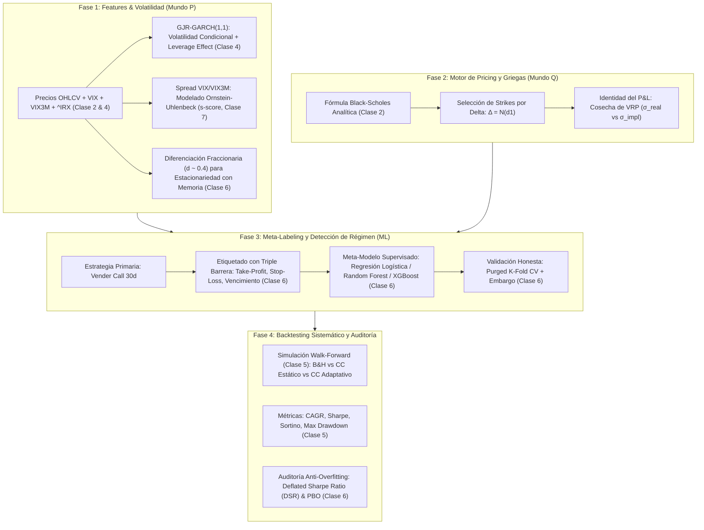

# 📈 Proyecto Cuantitativo: Covered Calls Condicionados por Regímenes de Volatilidad
### Formulación Metodológica basada estrictamente en el Programa de la Materia

> **Materia:** Finanzas Cuantitativas, la Ciencia y los Mercados — FCEN / UBA  
> **Docente:** Guido Schifani  
> **Tema:** Estrategia adaptativa de venta de opciones (*Covered Calls*) condicionada por modelos de volatilidad y meta-labeling de Machine Learning vs. *Buy & Hold* y estrategias pasivas.

---

## 🎯 1. Pregunta Central e Hipótesis Teórica

La venta sistemática de calls cubiertas (*Covered Call*: $+S - C(K)$) busca monetizar la **prima de riesgo de varianza (*Variance Risk Premium - VRP*)**: empíricamente, el mercado cotiza en promedio $\sigma_{impl} > \sigma_{real}$ (Clase 2, Ejercicio 4 de la práctica). 

Sin embargo, las estrategias estáticas (como el índice benchmark *Cboe BXM*) sufren de dos patologías estructurales:
1. **Techo al upside (*capping*):** En mercados alcistas con baja volatilidad (*bull runs* persistentes), la call vendida se ejerce y priva al portafolio de ganancias explosivas.
2. **Protección asimétrica insuficiente:** En escenarios de crash o pánico, la prima cobrada amortigua solo marginalmente la pérdida del subyacente.

**Hipótesis de investigación:**  
Un modelo adaptativo que combina:
- La medición de la volatilidad condicional con **GJR-GARCH** y el spread term-structure **Ornstein-Uhlenbeck** (Mundo $P$, Clases 4 y 7),
- El pricing analítico y selección de strike por **Delta Black-Scholes** (Mundo $Q$, Clases 2 y 3),
- Y un filtro de decisión mediante **Meta-Labeling** y **Triple Barrera** (Clase 6),  
logra superar el retorno ajustado por riesgo (*Sharpe Ratio* y *Sortino Ratio*) y mitigar el *Maximum Drawdown* frente al *Buy & Hold* pasivo, superando los tests de sobreajuste de backtesting (**Deflated Sharpe Ratio**, Clase 6).

---

## 🏛️ 2. Panel de Activos (Marco CAPM - Clase 4)

El panel contrasta activos con diferente estructura de riesgo según la descomposición del **CAPM** ($R_i - R_f = \alpha_i + \beta_i(R_m - R_f) + \varepsilon_i$):

| Activo | Naturaleza | Perfil de Riesgo Teórico (Clase 4) | Rol en la Estrategia |
| :--- | :--- | :--- | :--- |
| **`SPY`** | ETF S&P 500 | $\beta \approx 1.0$. Riesgo casi puramente **sistemático**; benchmark de mercado; máxima liquidez en opciones. | Validación contra el benchmark teórico y el BXM. |
| **`QQQ`** | ETF Nasdaq 100 | $\beta > 1.0$. Sesgo tecnológico / *growth*, mayor convexidad y volatilidad sistemática. | Test de *capping* de upside en rallies de alta velocidad. |
| **`NVDA`** | Acción individual | $\beta \gg 1.0$ con elevado **riesgo idiosincrático** ($\text{Var}(\varepsilon_i) \gg 0$) y *volatility smile* pronunciado. | Prueba de fuego: ¿sirve vender calls en un activo dominado por shocks idiosincráticos? |

---

## 🏗️ 3. Fases Metodológicas del Proyecto

---

### 🔹 Fase 1: Ingeniería de Features y Modelado de Volatilidad (Mundo $P$)
*Marco teórico: Clase 4 (Econometría y Series Temporales), Clase 6 (ML) y Clase 7 (Procesos OU).*

1. **Ingesta de Datos:**
   - Precios diarios ajustados (`Adj Close`), Open, High, Low, Close, Volume.
   - Variable macro: Tasa de interés libre de riesgo $r_f$ tomada de la tasa de descuento de T-Bills a 13 semanas (`^IRX`, Clase 2).
   - Índices de volatilidad implícita: `^VIX` (30 días) y `^VIX3M` (3 meses).
2. **Volatilidad Condicional Asimétrica con GJR-GARCH(1,1):**
   - La volatilidad no es constante; exhibe *clustering* y *leverage effect* (los retornos negativos disparan más volatilidad que los positivos, Clase 4):
     $$\sigma_t^2 = \omega + \left(\alpha + \gamma \cdot \mathbf{1}_{\{\varepsilon_{t-1} < 0\}}\right) \varepsilon_{t-1}^2 + \beta \sigma_{t-1}^2$$
   - Permite estimar $\sigma_t$ condicional para el día siguiente sin *lookahead bias*.
3. **Estructura Temporal del VIX como Proceso Ornstein-Uhlenbeck (OU):**
   - El ratio o spread $S_t = \ln(\text{VIX}_t) - \ln(\text{VIX3M}_t)$ refleja *contango* vs. *backwardation*.
   - Siguiendo la Clase 7, se modela como un proceso de reversión a la media:
     $$dS_t = \kappa (\theta - S_t)dt + \sigma_{ou} dW_t$$
   - Se calculan el **half-life** ($t_{1/2} = \frac{\ln 2}{\kappa}$) y el **s-score** normalizado para tipificar si el mercado está en régimen de calma estructurada ($s < 0$) o estrés extremo ($s > +2$).
4. **Estacionariedad con Memoria: Diferenciación Fraccionaria ($d$ óptimo):**
   - Siguiendo la Clase 6, en vez de usar retornos crudos ($d=1$, que borran la memoria del nivel) o precios crudos ($d=0$, no estacionarios):
   - Se halla el orden mínimo $d^* \in (0, 1)$ que hace a las series estacionarias según los tests **ADF** y **KPSS** (Clase 4) reteniendo una correlación $> 0.90$ con el nivel.

---

### 🔹 Fase 2: Motor de Pricing y Griegas (Mundo $Q$)
*Marco teórico: Clase 2 (Pricing I: Black-Scholes y No-Arbitraje) y Clase 3 (Smile).*

1. **Valuación Analítica Black-Scholes:**
   - Cálculo del precio teórico de la opción Call europea a vencimiento $T$ (horizonte mensual, $T \approx \frac{30}{252}$):
     $$C(S, K, T, r, \sigma) = S \cdot N(d_1) - K e^{-rT} N(d_2)$$
     $$d_1 = \frac{\ln(S/K) + (r + \frac{1}{2}\sigma^2)T}{\sigma\sqrt{T}}, \quad d_2 = d_1 - \sigma\sqrt{T}$$
2. **Selección de Strikes por Delta ($\Delta$):**
   - En lugar de fijar un porcentaje de dinero arbitrario, los strikes $K$ se seleccionan en función de la probabilidad neutra al riesgo aproximada dada por el Delta (Clase 2):
     $$\Delta = \frac{\partial C}{\partial S} = N(d_1)$$
   - Se calibran contratos para $\Delta = 0.50$ (ATM), $\Delta = 0.30$ (ligeramente OTM) y $\Delta = 0.15$ (defensivo / OTM lejano).
3. **Identidad del P&L de la Venta de Opciones:**
   - La rentabilidad teórica de la posición vendida deriva de la cosecha de la prima de riesgo de varianza (Clase 2, diapositiva 51):
     $$\text{P\&L} = \int_0^T \frac{1}{2} \Gamma S_t^2 \left( \sigma_{impl}^2 - \sigma_{real}^2 \right) dt$$
   - Si $\sigma_{impl} > \sigma_{real}$, el vendedor de volatilidad captura un flujo positivo neto compensado por el riesgo de cola (*tail risk*).

---

### 🔹 Fase 3: Detección de Regímenes mediante Meta-Labeling
*Marco teórico: Clase 6 (Machine Learning en Finanzas Cuantitativas).*

En lugar de utilizar algoritmos de clustering genéricos no financieros (como K-Means ciego), se implementa la arquitectura rigurosa de **López de Prado enseñada en la Clase 6**:

1. **Modelo Primario (Regla Base):**
   - Una regla heurística sencilla propone vender una call mensual a delta $\Delta = 0.30$ cada inicio de mes.
2. **Etiquetado con Triple Barrera:**
   - Alrededor de cada fecha de inicio de trade mensual se definen 3 barreras horizontales y verticales adaptadas a la volatilidad diaria $\sigma_t$ (Clase 6):
     - **Barrera Superior (Take-Profit):** Decaimiento rápido del valor temporal de la call ($\ge 75\%$ de la prima capturada). Etiqueta = $+1$.
     - **Barrera Inferior (Stop-Loss):** Caída abrupta del subyacente que supera el amortiguador de la prima cobrada. Etiqueta = $0$ (o trade perdedor).
     - **Barrera Vertical (Tiempo):** Llegada al día 30 (vencimiento del contrato).
3. **Meta-Modelo Supervisado (Filtro de Régimen y Bet Sizing):**
   - Se entrenan modelos supervisados de la Clase 6:
     - **Baseline:** Regresión Logística (probabilidades calibradas, interpretable).
     - **Modelos No Lineales:** Random Forest y Gradient Boosting / XGBoost.
   - **Features de entrada:** $\sigma_{GARCH}$, ratio $\frac{\sigma_{GARCH}}{\text{VIX}}$, s-score del spread VIX/VIX3M, serie fraccionaria de retornos, distancia al máximo histórico (*drawdown*).
   - **Salida:** Probabilidad $P(y=1 | x_t)$ de que las condiciones actuales sean propicias para vender la call. Si la confianza es baja (régimen de pánico o rally violento inminente), la recomendación es **no vender call** (quedarse 100% long subyacente para capturar el upside o evitar pérdidas de gamma).
4. **Validación Honesta: Purged K-Fold Cross-Validation + Embargo:**
   - Dado que las opciones mensuales tienen 30 días de duración, las etiquetas consecutivas se solapan en el tiempo.
   - Se aplica **Purga** de las observaciones de entrenamiento que solapen con el conjunto de test y **Embargo** temporal posterior (Clase 6, diapositivas 26-28) para garantizar $0\%$ de *leakage*.

---

### 🔹 Fase 4: Motor de Backtesting Sistemático y Auditoría Anti-Overfitting
*Marco teórico: Clase 4, Clase 5 (Teoría de Portafolio y Backtest Walk-Forward) y Clase 6 (Deflated Sharpe).*

1. **Estrategias a Comparar en Paralelo:**
   - **Benchmark 1:** *Buy & Hold* pasivo del subyacente (SPY, QQQ, NVDA).
   - **Benchmark 2:** *Covered Call Estático* (venta incondicional cada 30 días a $\Delta = 0.30$, análogo al índice BXM).
   - **Estrategia Adaptativa:** Covered Call condicionado por el Meta-Modelo (ajuste dinámico de $\Delta$ o veto de venta según la probabilidad de régimen).
2. **Esquema de Simulación Walk-Forward (Clase 5):**
   - Ventana de entrenamiento expandible (o rodante de 252 ruedas) con reevaluación secuencial periódica.
   - Evaluación obligatoria de stress-testing: comportamiento en la crisis de 2020 (Covid Crash) vs. el bull run sostenido posterior (2021-2024), respetando la lección de la diapositiva 72 de la Clase 5 ("el resultado depende de si la muestra incluye una crisis o no").
3. **Métricas Cuantitativas de Evaluación:**
   - Retorno Acumulado y **CAGR**.
   - **Volatilidad Anualizada:** $\sigma_{anual} = \sigma_{diaria} \sqrt{252}$.
   - **Sharpe Ratio:** $\text{SR} = \frac{\overline{R} - R_f}{\sigma_{anual}}$.
   - **Sortino Ratio:** penalizando solo la volatilidad a la baja (*downside deviation*).
   - **Maximum Drawdown (MDD)** y Duración del Drawdown.
   - Tasa de ejercicio / asignación (% de contratos que terminan ITM).
4. **Auditoría Anti-Overfitting (Clase 6):**
   - **Deflated Sharpe Ratio (DSR):** Cálculo formal ajustando por asimetría, kurtosis y por el número total de combinaciones de strikes/umbrales probados durante la investigación (Bailey & López de Prado, Clase 6, diapositiva 50).
   - Verificación de que el Sharpe reportado sea estadísticamente superior al Sharpe esperado del azar ($SR_0$).

---

### 🔹 Fase 5: Entregables del TP
1. **Pipeline Reproducible:** Módulos en `src/` que corren secuencialmente la descarga, el feature engineering, el modelado y el backtest.
2. **CLI de Recomendación Operativa en Tiempo Real:** Script que toma el dato de la rueda actual de mercado y emite la recomendación cuantitativa:
   $$\text{Output: } [\text{Activo}, \text{Régimen Detectado}, P(\text{Éxito}), \text{Acción: Vender Call / Mantener}, \text{Strike Sugerido}, \Delta]$$
3. **Póster y Documento Académico:** Conclusiones empíricas sobre si el *Variance Risk Premium* pudo cosecharse eficientemente sin ceder el crecimiento de largo plazo de los activos de mayor beta.

---

## 📌 Checklist de Tareas del Proyecto (Plan de Acción)

- [x] **Infraestructura y Pipeline de Datos Base:** Repositorio estructurado y script funcional (`src/download_market_data.py`) guardando en `data/panel_activos_macro.parquet`.
- [ ] **Módulo 1 (`src/features.py`):** GJR-GARCH(1,1), proceso OU de la estructura temporal de VIX y diferenciación fraccionaria.
- [ ] **Módulo 2 (`src/pricing.py`):** Motor Black-Scholes analítico vectorizado y cálculo de Griegas.
- [ ] **Módulo 3 (`src/meta_labeling.py`):** Etiquetado por Triple Barrera, Purged K-Fold con Embargo y entrenamiento de Regresión Logística / Random Forest.
- [ ] **Módulo 4 (`src/backtest.py`):** Simulación Walk-Forward comparativa (B&H vs Estático vs Adaptativo) y cálculo de métricas (Sharpe, Sortino, MaxDD, DSR).
- [ ] **Módulo 5 (`src/cli_advisor.py`):** Generador de recomendaciones en vivo.
- [ ] **Notebooks y Visualizaciones:** Curvas de equity, News Impact Curves, matrices de confusión y gráficos de regímenes.
- [ ] **Póster y Entrega Final:** Redacción formal para la cátedra de Finanzas Cuantitativas (FCEN-UBA).
