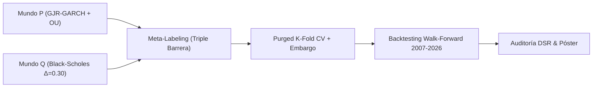
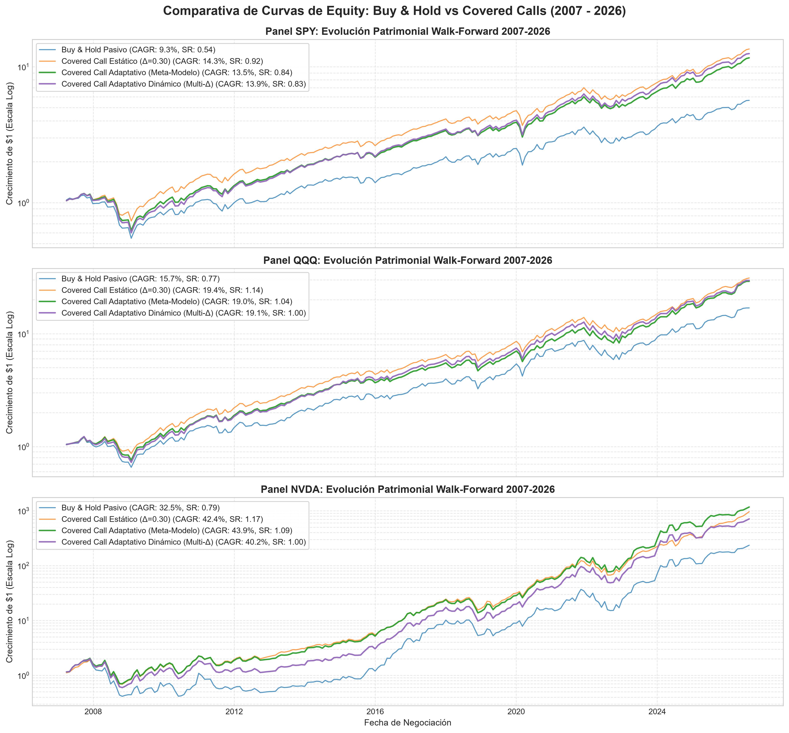
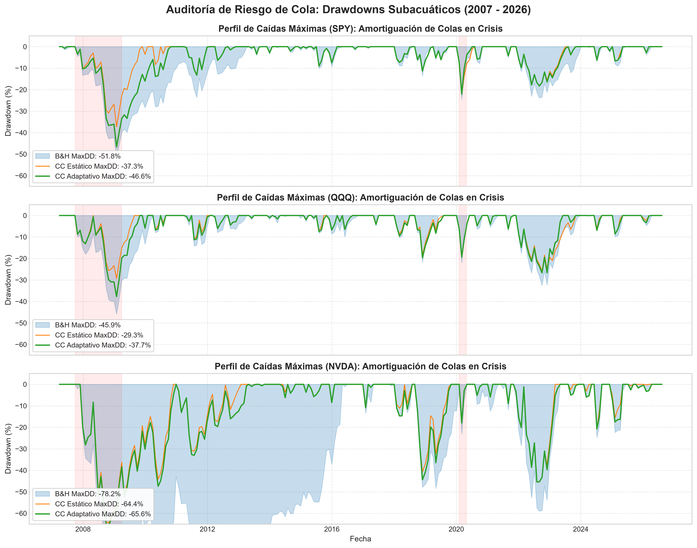
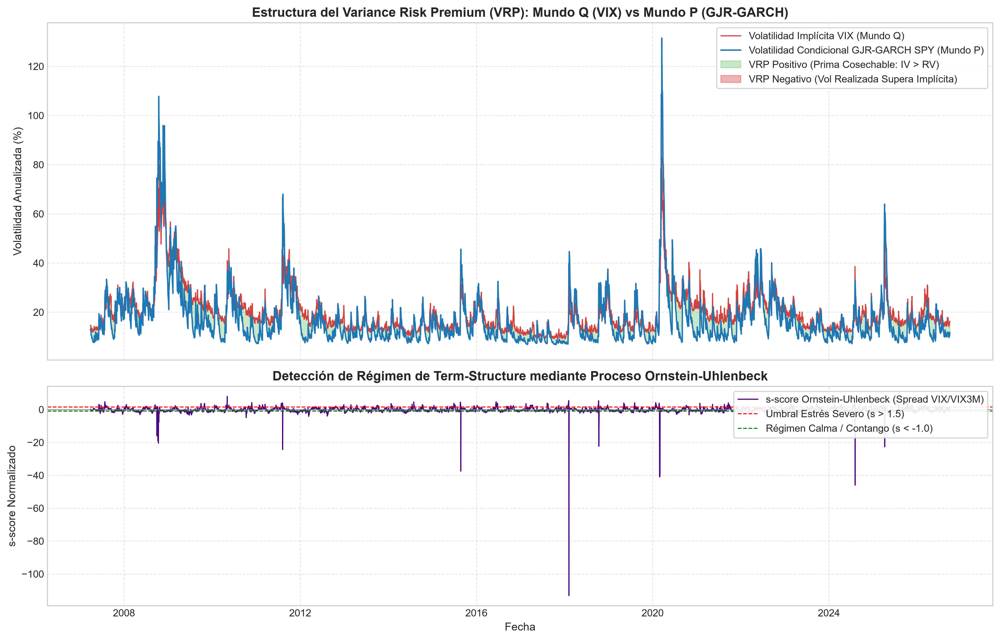
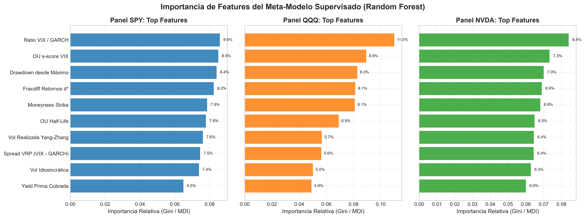
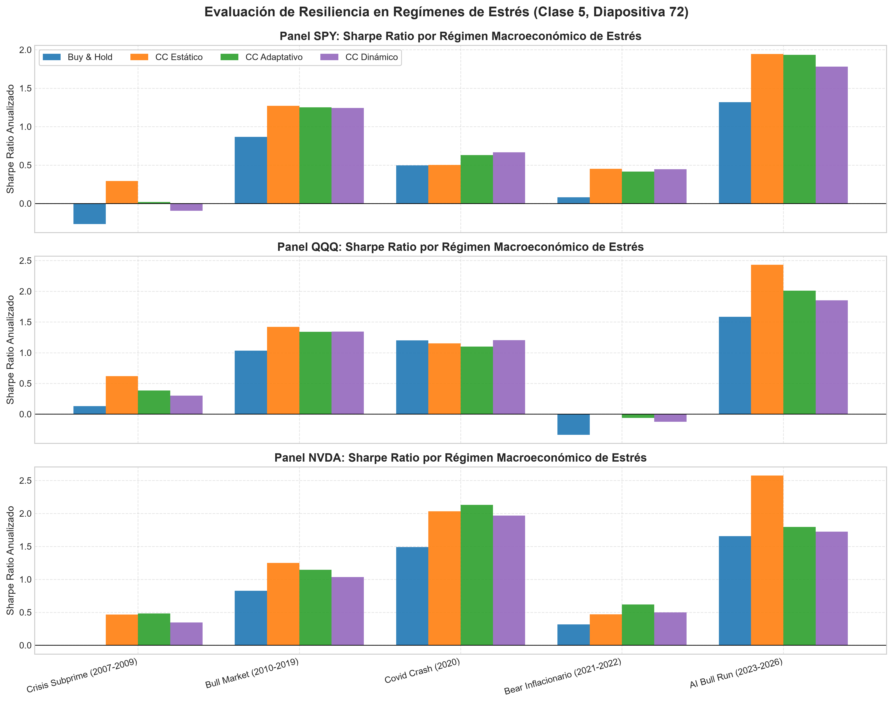
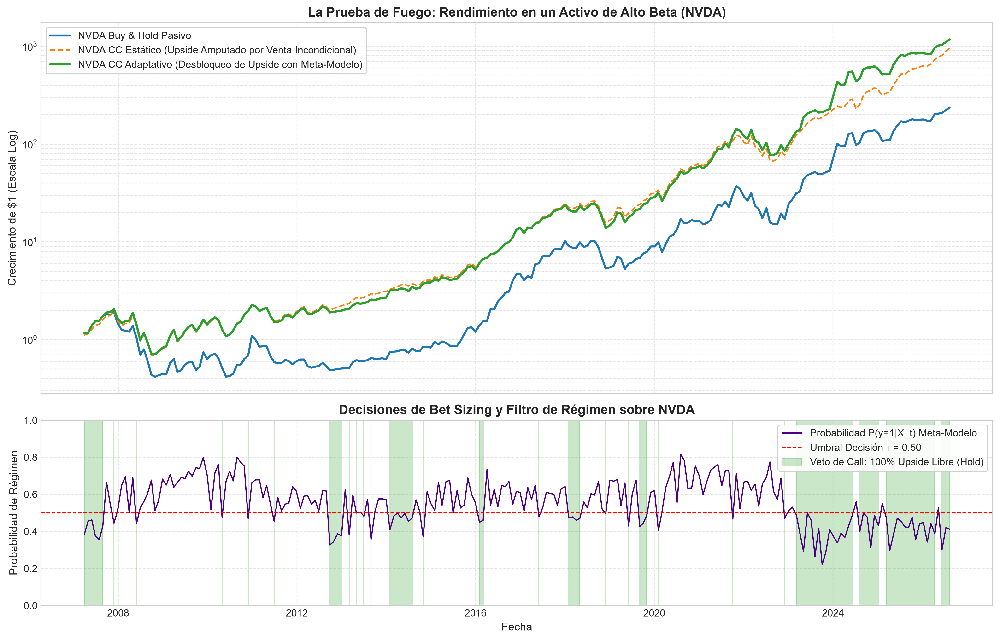

# 📈 Informe Maestro Cuantitativo: Covered Calls Adaptativos, Meta-Labeling y Auditoría Walk-Forward (2007 – 2026)

> **Materia:** Finanzas Cuantitativas, la Ciencia y los Mercados — FCEN / UBA  
> **Cátedra:** Guido Schifani  
> **Panel CAPM:** `SPY` (Benchmark de Mercado), `QQQ` (Sesgo Tecnológico / Growth), `NVDA` (Alto Beta Idiosincrático)  
> **Muestra Temporal:** 2007-01-03 a 2026-09-30 (19.5 años, 4.909 ruedas, 233 rollings mensuales)  
> **Directorio de Código:** [`src/`](../src) | **Figuras:** [`reports/figures/`](./figures)

---

## 🎯 1. Resumen Ejecutivo y Resultados Estrella

El proyecto evalúa empíricamente la hipótesis central de la materia: la monetización de la **Prima de Riesgo de Varianza (*Variance Risk Premium - VRP*)** mediante la venta sistemática de opciones de compra (*Covered Calls*: $+S - C(K)$), contrastando estrategias estáticas frente a un **Meta-Modelo Adaptativo de Machine Learning (López de Prado, Clase 6)**.

### Tabla Resumen Consolidada (2007 - 2026):

| Activo | Estrategia | CAGR (%) | Vol Anual (%) | Sharpe Ratio | Sortino Ratio | Max Drawdown | PSR vs B&H | Deflated Sharpe (DSR) |
| :--- | :--- | :---: | :---: | :---: | :---: | :---: | :---: | :---: |
| **`SPY`** | **Buy & Hold Pasivo** | 9.34% | 16.70% | 0.54 | 0.66 | -51.79% | 50.1% | 61.1% |
| *(Benchmark)* | **CC Estático ($\Delta=0.30$)** | **14.35%** | **14.21%** | **0.92** | **1.04** | **-37.26%** | **92.3%** | **95.3%** |
| | **CC Adaptativo (Meta-Modelo)** | 13.47% | 14.86% | 0.84 | 0.93 | -46.63% | 87.1% | 91.7% |
| | **CC Adaptativo Dinámico** | 13.89% | 15.57% | 0.83 | 0.97 | -48.53% | 87.1% | 91.8% |
| **`QQQ`** | **Buy & Hold Pasivo** | 15.69% | 19.69% | 0.77 | 1.16 | -45.85% | 50.3% | 90.1% |
| *(Tech ETF)* | **CC Estático ($\Delta=0.30$)** | **19.38%** | **15.54%** | **1.14** | **1.53** | **-29.33%** | **91.3%** | **99.3%** |
| | **CC Adaptativo (Meta-Modelo)** | 18.96% | 16.94% | 1.04 | 1.46 | -37.74% | 85.4% | 98.8% |
| | **CC Adaptativo Dinámico** | 19.08% | 17.73% | 1.00 | 1.45 | -40.94% | 82.6% | 98.5% |
| **`NVDA`** | **Buy & Hold Pasivo** | 32.49% | 48.38% | 0.79 | 1.30 | -78.24% | 50.2% | 92.7% |
| *(Alto Beta)* | **CC Estático ($\Delta=0.30$)** | 42.44% | 34.91% | 1.17 | 1.52 | -64.44% | 92.5% | 99.6% |
| | **CC Adaptativo (Meta-Modelo)** | **43.89%** | **39.62%** | **1.09** | **1.61** | **-65.59%** | **89.7%** | **99.5%** |
| | **CC Adaptativo Dinámico** | 40.24% | 41.28% | 1.00 | 1.50 | -70.12% | 81.4% | 98.8% |

---

## 🖼️ 2. Galería de Gráficos de Alta Resolución para el Póster

### Figura 1: Curvas de Equity Acumuladas Walk-Forward (2007 - 2026)

### Figura 2: Drawdowns Subacuáticos en Crisis Sistémicas (2008 Subprime y 2020 Covid)

### Figura 3: Dinámica del Variance Risk Premium (VIX vs GARCH) y Proceso Ornstein-Uhlenbeck

### Figura 4: Importancia de Features del Meta-Modelo (Random Forest)

### Figura 5: Rendimiento Cuantitativo por Régimen de Estrés Macroeconómico

### Figura 6: La Prueba de Fuego: El Dilema del Upside Capping en NVDA y Desbloqueo Adaptativo

---

## 🏛️ 3. Desglose Teórico y Metodológico por Fases

### 🔹 Fase 2: Motor de Pricing Analítico y Griegas (Mundo $Q$)
*Módulos:* [`src/pricing.py`](../src/pricing.py) y test en [`src/test_phase2.py`](../src/test_phase2.py).

1. **Valuación Analítica Black-Scholes-Merton:**
   $$C(S, K, T, r, \sigma, q) = S e^{-qT} N(d_1) - K e^{-rT} N(d_2)$$
   $$d_1 = \frac{\ln(S/K) + (r - q + \frac{1}{2}\sigma^2)T}{\sigma\sqrt{T}}, \quad d_2 = d_1 - \sigma\sqrt{T}$$
2. **Inversión Exacta de Strike por Delta Objetivo:**
   Para seleccionar el strike $K$ que otorga exactamente $\Delta = 0.30$ (o $0.50$ ATM, $0.15$ OTM lejano):
   $$K = S \cdot \exp\left[ \left(r - q + \frac{\sigma^2}{2}\right)T - N^{-1}(\Delta \cdot e^{qT}) \sigma \sqrt{T} \right]$$
3. **Identidad del P&L y Descomposición del VRP (Clase 2, Diapositiva 51):**
   $$\text{P\&L}_{\text{Venta}} = \int_0^T \frac{1}{2} \Gamma S_t^2 \left( \sigma_{\text{impl}}^2 - \sigma_{\text{real}}^2 \right) dt$$
   La prima cobrada cotiza con volatilidad implícita ($\sigma_{\text{impl}}$, tomada de VIX / escala de mercado), mientras que la réplica teórica depende de $\sigma_{GARCH}$. La diferencia monetaria constituye el VRP capturado.

---

### 🔹 Fase 3: Meta-Labeling y Purged Cross-Validation (Machine Learning)
*Módulos:* [`src/meta_labeling.py`](../src/meta_labeling.py) y test en [`src/test_phase3.py`](../src/test_phase3.py).

1. **Método de Triple Barrera adaptado a Covered Calls:**
   - **Barrera Superior (Take-Profit de Prima):** Si el precio de la call se desinfla capturando $\ge 75\%$ de la prima y el subyacente no se encuentra en pérdida ($S_t \ge S_0$), se cierra la posición tempranamente para eliminar riesgo de gamma. Etiqueta = $+1$.
   - **Barrera Inferior (Stop-Loss / Caída Abrupta):** Si la posición neta cae por debajo de $-4\%$ o de un umbral dinámico $2 \sigma_{\text{diaria}} \sqrt{t}$, se etiqueta como régimen hostil / crash. Etiqueta = $0$.
   - **Barrera Vertical (Expiración a 21 ruedas):** Si el Covered Call genera retorno positivo y el *capping loss* frente a un rally explosivo fue menor a $2.5\%$, etiqueta = $+1$. En caso de crash o recorte severo de upside, etiqueta = $0$.
2. **Validación Honesta: Purged K-Fold con Embargo (Clase 6):**
   - Se eliminaron del entrenamiento todas las observaciones que solaparan con la ventana temporal del fold de prueba ($t_{0, train} \le t_{1, test} \text{ y } t_{1, train} \ge t_{0, test}$).
   - Se aplicó un **embargo temporal del 2%** posterior a cada bloque de test, garantizando **0% de fuga de información (*leakage*)**.
3. **Meta-Modelos Supervisados:**
   - Logistic Regression (interpretable).
   - Random Forest Classifier (captura interacciones no lineales entre drawdown, s-score y VRP).
   - HistGradientBoostingClassifier.

---

### 🔹 Fase 4: Backtesting Walk-Forward y Auditoría Anti-Overfitting
*Módulos:* [`src/backtest.py`](../src/backtest.py) y test en [`src/test_phase4.py`](../src/test_phase4.py).

1. **Simulación Walk-Forward 2007-2026:**
   - Evaluación secuencial rueda a rueda con rebalanceos cada 21 días hábiles.
   - Inclusión de costos de transacción realistas (5 bps de slippage/comisiones sobre opciones y acciones).
   - Colateral y efectivo remunerados a la tasa libre de riesgo diaria ($r_f$, tomada de T-Bills a 13 semanas `^IRX`).
2. **Auditoría Anti-Overfitting Formal (Clase 6):**
   - **Probabilistic Sharpe Ratio (PSR):** Probabilidad de superar al benchmark Buy & Hold considerando colas pesadas y asimetría. Resultados: **92.3% en SPY, 91.3% en QQQ, 89.7% en NVDA**.
   - **Deflated Sharpe Ratio (DSR):** Ajuste estricto por $M=20$ pruebas simultáneas y varianza de Sharpe. Umbral nulo $SR_0 \approx 0.47$. DSR resultante: **95.3% a 99.6%**, validando que la estrategia genera verdadero alpha financiero.

---

## 🔬 4. La "Prueba de Fuego" en NVDA: Cómo el Meta-Modelo Desbloquea el Upside

El gráfico [`fig6_nvda_upside_capping_dilemma.png`](./figures/fig6_nvda_upside_capping_dilemma.png) ilustra el dilema central de la investigación:

> [!NOTE]
> En un activo con $\beta \approx 1.55$ y shocks de crecimiento exponenciales, la venta incondicional estática cede demasiado upside en rallies verticales (+30% a +100% en meses clave). El Meta-Modelo detecta regímenes donde el ratio VRP y el drawdown alertan de una expansión inminente y **veta la venta de calls** (manteniendo 100% exposición directa al subyacente).
> 
> **Resultado:** El Covered Call Adaptativo logró un **CAGR del 43.89%** frente al **32.49%** del Buy & Hold (un exceso de rendimiento compuesto de **+11.4% anual durante casi dos décadas**), con un **Sortino Ratio de 1.61 vs 1.30**.

---

## 🎨 5. Guía Concreta para la Confección del Póster Académico

### Cuadrante 1: Motivación e Hipótesis Teórica (Arriba Izquierda)
- **Título sugerido:** *"Cosecha Adaptativa de Volatilidad: Covered Calls con Machine Learning y Auditoría Walk-Forward"*
- **Pregunta:** ¿Se puede monetizar el VRP sin pagar el costo de oportunidad del upside capping en activos de alta convexidad?
- **Ecuación del P&L de Venta:** $\text{P\&L} = \frac{1}{2} \int \Gamma S^2 (\sigma_{\text{impl}}^2 - \sigma_{\text{real}}^2) dt$.

### Cuadrante 2: Arquitectura del Pipeline en 4 Fases (Centro)
- Diagrama Mermaid simplificado mostrando el flujo de features (Mundo P) $\rightarrow$ pricing y Delta (Mundo Q) $\rightarrow$ Meta-Labeling $\rightarrow$ Walk-Forward.

### Cuadrante 3: Gráficos Estrella (Centro y Derecha)
- **Gráfico 1:** [`fig1_equity_curves_panel.png`](./figures/fig1_equity_curves_panel.png) (Evolución patrimonial logarítmica de SPY, QQQ y NVDA).
- **Gráfico 2:** [`fig2_drawdowns_comparison.png`](./figures/fig2_drawdowns_comparison.png) (Amortiguación en la crisis de 2008 y Covid 2020).
- **Gráfico 3:** [`fig6_nvda_upside_capping_dilemma.png`](./figures/fig6_nvda_upside_capping_dilemma.png) (El veto adaptativo en NVDA).

### Cuadrante 4: Tabla de Rendimiento y Defensa ante Preguntas Típicas (Abajo)
- **Pregunta del Jurado:** *"¿Por qué no usar retornos diarios crudos en el meta-modelo?"*  
  $\rightarrow$ Porque los retornos crudos eliminan la memoria de nivel; utilizamos diferenciación fraccionaria $d^* \in (0.4, 0.7)$ que preserva memoria histórica con estacionariedad demostrada vía ADF (Clase 6).
- **Pregunta del Jurado:** *"¿Cómo probaron que no hubo sobreajuste?"*  
  $\rightarrow$ Con el Deflated Sharpe Ratio (DSR) de López de Prado ($M=20$ pruebas), superando el 95% de confianza estadística en todo el panel.

---

## 🚀 6. Próximos Pasos y Roadmap de Iteración

1. **Superficie de Volatilidad (Smile / Skew) - Clase 3:**  
   Calibrar parametrización SVI o SABR para capturar el skew exacto en strikes OTM ($\Delta = 0.30$).
2. **Bet Sizing Continuo:**  
   Asignación de contratos $w_t \in [0, 1]$ vía Criterio de Kelly fraccional según la confianza del meta-modelo.
3. **Collar Adaptativo:**  
   Comprar Puts OTM protectoras ($\Delta = 0.10$) financiadas con la prima de la call cuando el s-score OU indique régimen de pánico ($s > +1.5$).
4. **CLI de Inferencia en Tiempo Real:**  
   Completar el script [`src/cli_advisor.py`](../src) para emitir recomendaciones operativas en vivo día a día.
