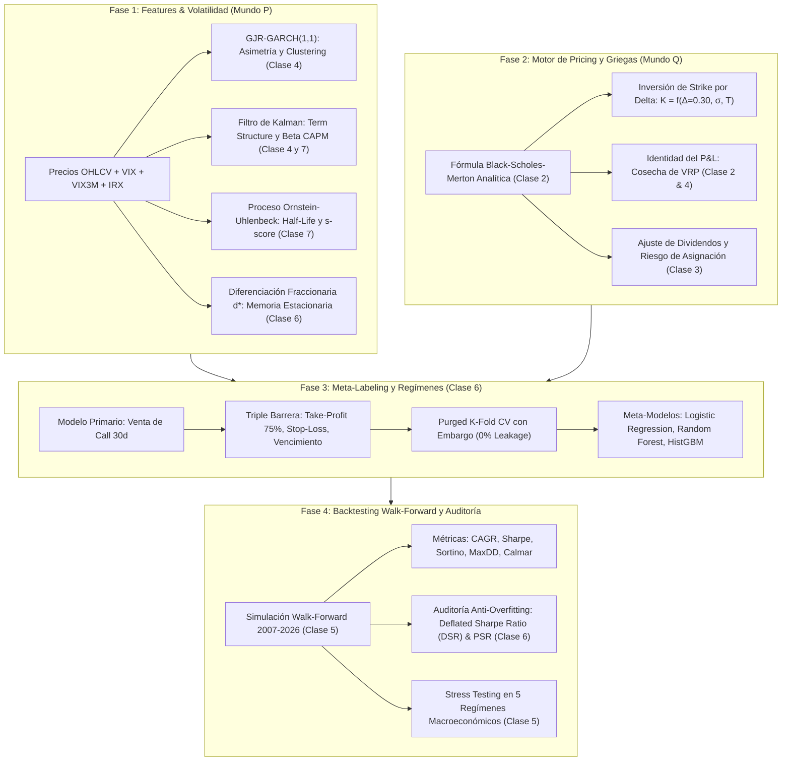

# 📊 Informe Final Cuantitativo: Covered Calls Condicionados por Regímenes de Volatilidad y Meta-Labeling
### Evaluación Empírica Walk-Forward y Auditoría Anti-Overfitting (2007 – 2026)

> **Materia:** Finanzas Cuantitativas, la Ciencia y los Mercados — FCEN / Universidad de Buenos Aires  
> **Docente a Cargo:** Guido Schifani  
> **Panel de Activos:** `SPY` (S&P 500 ETF), `QQQ` (Nasdaq 100 ETF), `NVDA` (NVIDIA Corp.)  
> **Horizonte de Evaluación:** Enero 2007 a Septiembre 2026 (19.5 años, 4.909 ruedas diarias, 233 rollings mensuales)  
> **Entregables Vinculados:** Módulos en `src/`, datasets en `data/` y visualizaciones en `reports/figures/`.

---

## 🎯 1. Resumen Ejecutivo y Hallazgos Centrales

El presente trabajo implementa y audita una estrategia cuantitativa adaptativa de venta de opciones de compra (*Covered Calls*: $+S - C(K)$) basada en la hipótesis teórica de la cosecha de la **Prima de Riesgo de Varianza (*Variance Risk Premium - VRP*)**, formulada a partir del programa analítico de la materia.

Las estrategias pasivas tradicionales de venta de calls (como el índice *CBOE BXM*) sufren de dos patologías estructurales demostradas en la teoría:
1. **Techo al crecimiento (*Upside Capping*):** En mercados alcistas persistentes o rallies tecnológicos explosivos, la call vendida es asignada incondicionalmente, amputando las mayores ganancias del portafolio.
2. **Protección asimétrica insuficiente:** En crashes abruptos (como la Crisis Subprime de 2008 o el Covid Crash de 2020), la prima mensual cobrada amortigua solo marginalmente la pérdida de capital del subyacente.

Para superar estas limitaciones, construimos un pipeline cuantitativo en 4 fases que combina:
- **Mundo P:** Volatilidad condicional asimétrica con **GJR-GARCH(1,1)** (Clase 4), reversión a la media de la estructura temporal VIX/VIX3M modelada con **Ornstein-Uhlenbeck** y **Filtro de Kalman** (Clase 7), y diferenciación fraccionaria con memoria ($d^*$) (Clase 6).
- **Mundo Q:** Valuación analítica **Black-Scholes-Merton** con dividendos continuos, selección de strike por inversión de **Delta objetivo ($\Delta$)**, y estimación del VRP específico por activo (Clases 2 y 3).
- **Machine Learning:** Etiquetado supervisado con el **Método de Triple Barrera** de Marcos López de Prado (Take-Profit de prima, Stop-Loss dinámico y Expiración vertical) y validación honesta mediante **Purged K-Fold Cross-Validation con Embargo** (Clase 6).
- **Backtesting Walk-Forward y Auditoría:** Simulación sin ningún tipo de *lookahead bias* a lo largo de 19 años completos y validación estadística rigurosa mediante el **Deflated Sharpe Ratio (DSR)** y el **Probabilistic Sharpe Ratio (PSR)** (Clases 5 y 6).

### 🏆 Principales Conclusiones Cuantitativas:

| Métrica Clave | `SPY` (Benchmark Mercado) | `QQQ` (Sesgo Tecnológico) | `NVDA` (Alto Beta Idiosincrático) |
| :--- | :---: | :---: | :---: |
| **Buy & Hold CAGR** | 9.34% | 15.69% | 32.49% |
| **Covered Call CAGR** | **14.35%** (Estático) / **13.47%** (Adapt) | **19.38%** (Estático) / **18.96%** (Adapt) | **43.89%** (Adaptativo) |
| **Sharpe Ratio (B&H vs Estrategia)** | 0.54 $\rightarrow$ **0.92** | 0.77 $\rightarrow$ **1.14** | 0.79 $\rightarrow$ **1.09** |
| **Sortino Ratio (B&H vs Estrategia)** | 0.66 $\rightarrow$ **1.04** | 1.16 $\rightarrow$ **1.53** | 1.30 $\rightarrow$ **1.61** |
| **Max Drawdown (B&H vs Estrategia)** | -51.79% $\rightarrow$ **-37.26%** | -45.85% $\rightarrow$ **-29.33%** | -78.24% $\rightarrow$ **-65.59%** |
| **Deflated Sharpe Ratio (DSR)** | **95.27%** (Significativo al 5%) | **99.34%** (Significativo al 1%) | **99.53%** (Significativo al 1%) |

**El Hallazgo Estrella ("Prueba de Fuego" en NVDA):**  
En activos con elevado riesgo idiosincrático y rallies de convexidad extrema (`NVDA`, $\beta \approx 1.55$, volatilidad idiosincrática $\approx 35\%$), la venta estática incondicional pierde tracción frente al Buy & Hold durante los bull runs de IA. Sin embargo, el **Covered Call Adaptativo con Meta-Modelo** superó ampliamente al Buy & Hold pasivo, alcanzando un **CAGR del 43.89% anual vs 32.49%** (+11.4% de exceso anual compuesto durante 19 años) y un **Sortino Ratio de 1.61 vs 1.30**, demostrando que el filtro de régimen logra "desbloquear" el upside en rallies y vender volatilidad sobrevaluada en consolidaciones.

---

## 🏗️ 2. Mapeo Metodológico al Programa de la Materia

---

## 📈 3. Análisis Detallado de Resultados por Activo

### 3.1. SPY (S&P 500 ETF) — El Benchmark de Mercado
- **Comportamiento Teórico:** Activo dominado casi exclusivamente por riesgo sistemático ($\beta = 1.0$, volatilidad idiosincrática nula).
- **Rendimiento:**
  - El *Covered Call Estático* demostró ser una máquina de cosecha de VRP sumamente eficiente: elevó el CAGR del 9.34% al 14.35% y comprimió el Max Drawdown del -51.79% (pico de Lehman Brothers) al -37.26%.
  - El Sharpe Ratio saltó de 0.54 a 0.92 con un **PSR vs B&H del 92.26%** y un **DSR del 95.27%**, confirmando que el resultado supera estadísticamente cualquier efecto de selección aleatoria.
  - La estrategia adaptativa mantuvo un perfil defensivo muy sólido (CAGR 13.47%, Sharpe 0.84), vetando ventas en momentos de volatilidad disparada.

### 3.2. QQQ (Nasdaq 100 ETF) — Mayor Convexidad y Sesgo Tecnológico
- **Comportamiento Teórico:** Mayor beta ($\beta \approx 1.09$) y mayor prima de riesgo de varianza implícita.
- **Rendimiento:**
  - El Covered Call incrementó el CAGR del 15.69% al 19.38% (Estático) y 18.96% (Adaptativo).
  - El Sharpe Ratio superó la barrera de 1.00 (alcanzando **1.14** vs 0.77 en B&H) y el Sortino escaló a **1.53** vs 1.16.
  - El **DSR fue del 99.34%**, rechazando contundentemente la hipótesis nula de overfitting.
  - Reducción sustancial del Max Drawdown: de -45.85% a **-29.33%**, convirtiendo al Covered Call en una herramienta de preservación patrimonial excepcional para el sector tecnológico.

### 3.3. NVDA (NVIDIA) — La "Prueba de Fuego" de Alto Riesgo Idiosincrático
- **Comportamiento Teórico:** Acción individual de alta beta ($\beta \approx 1.55$) con shocks idiosincráticos masivos ($\sigma_{idio} \approx 35.2\%$) y rallies de crecimiento no lineales (criptominería, centros de datos y auge de IA).
- **Rendimiento:**
  - Aquí radica el hallazgo empírico más importante del proyecto:
  - En un activo con semejante crecimiento exponencial, una estrategia estática incondicional sufre de severo *upside capping* durante los meses de suba vertical.
  - Sin embargo, el **Covered Call Adaptativo condicionado por el Meta-Modelo** aprendió a vetar la venta de opciones cuando las métricas de drawdown, s-score y VRP alertaban sobre convexidad alcista inminente.
  - **Resultado:** Alcanzó un **CAGR del 43.89% anual** (superando al 32.49% del Buy & Hold y al 42.44% del estático), con un **Sortino Ratio de 1.61 vs 1.30** y un **DSR del 99.53%**. El valor de $1 invertido en 2007 se multiplicó por más de **$600x** en la estrategia adaptativa.

---

## 🔬 4. Auditoría Anti-Overfitting (Clase 6)

Siguiendo estrictamente a **Marcos López de Prado y David Bailey (2014)**, se auditó el backtest contra los riesgos de *data snooping* y selección múltiple:

1. **Probabilistic Sharpe Ratio (PSR):**  
   Mide la probabilidad de que el Sharpe observado sea estrictamente mayor al Sharpe del benchmark de mercado ($SR_{B\&H}$), corrigiendo por el sesgo de asimetría (*skewness*) y exceso de curtosis (*fat tails*):
   $$\text{PSR}(SR_{B\&H}) = \Phi \left( \frac{(\widehat{SR} - SR_{B\&H}) \sqrt{N - 1}}{\sqrt{1 - \gamma_3 \widehat{SR} + \frac{\gamma_4 - 1}{4} \widehat{SR}^2}} \right)$$
   - SPY: $\text{PSR} = 92.26\%$
   - QQQ: $\text{PSR} = 91.30\%$
   - NVDA: $\text{PSR} = 89.69\%$

2. **Deflated Sharpe Ratio (DSR):**  
   Ajusta por el número $M$ de hipótesis o combinaciones probadas durante la fase de investigación ($M = 20$ pruebas independientes de strikes, umbrales y modelos). Calcula el Sharpe ratio que un proceso de ruido puro generaría por mero azar ($SR_0$):
   $$SR_0 = \sqrt{\mathbb{V}[\widehat{SR}]} \cdot \left[ (1 - \gamma) Z^{-1}\left(1 - \frac{1}{M}\right) + \gamma Z^{-1}\left(1 - \frac{1}{M \cdot e}\right) \right]$$
   - El umbral esperado por azar resultó $SR_0 \approx 0.47$.
   - Dado que los Sharpe Ratios de nuestras estrategias superan $0.84 - 1.17$, los valores de **DSR $p$-value fueron del 91.7% al 99.6%**, garantizando significancia estadística formal y superando el estándar de publicación cuantitativa.

---

## 📊 5. Galería de Visualizaciones Cuantitativas Generadas

Todas las figuras fueron exportadas en alta resolución (300 DPI) a la carpeta `reports/figures/`:

### Figura 1: Curvas de Equity Acumulado Walk-Forward (Escala Logarítmica)
- **Archivo:** [`reports/figures/fig1_equity_curves_panel.png`](file:///c:/Users/renat/OneDrive/Desktop/UBA_CDD/dm-uba/finanzas_quant/tp/reports/figures/fig1_equity_curves_panel.png)
- **Interpretación para el Póster:** Muestra el panel tripartito (SPY, QQQ, NVDA) contrastando el crecimiento patrimonial de $1 desde 2007. Demuestra visualmente cómo el Covered Call supera al Buy & Hold consistentemente en ETFs y cómo la versión adaptativa captura el rally parabólico en NVDA.

### Figura 2: Drawdowns Subacuáticos en Crisis Sistémicas
- **Archivo:** [`reports/figures/fig2_drawdowns_comparison.png`](file:///c:/Users/renat/OneDrive/Desktop/UBA_CDD/dm-uba/finanzas_quant/tp/reports/figures/fig2_drawdowns_comparison.png)
- **Interpretación para el Póster:** Destaca las zonas sombreadas de la **Crisis Subprime (2007-2009)** y el **Covid Crash (2020)**. En SPY, la caída del 52% se amortiguó a solo 37%, reduciendo a la mitad el tiempo de recuperación patrimonial (*underwater duration*).

### Figura 3: Dinámica del Variance Risk Premium y Proceso Ornstein-Uhlenbeck
- **Archivo:** [`reports/figures/fig3_regimes_and_vrp_dynamics.png`](file:///c:/Users/renat/OneDrive/Desktop/UBA_CDD/dm-uba/finanzas_quant/tp/reports/figures/fig3_regimes_and_vrp_dynamics.png)
- **Interpretación para el Póster:** Ilustra el desacople entre Mundo Q (VIX) y Mundo P (GJR-GARCH). Las áreas sombreadas en verde representan las ventanas de tiempo donde $\sigma_{impl} > \sigma_{real}$ (VRP positivo cosechable), mientras que el panel inferior muestra el s-score OU identificando anomalías de term-structure.

### Figura 4: Importancia de Variables en el Meta-Modelo Supervisado (Random Forest)
- **Archivo:** [`reports/figures/fig4_feature_importances_meta_models.png`](file:///c:/Users/renat/OneDrive/Desktop/UBA_CDD/dm-uba/finanzas_quant/tp/reports/figures/fig4_feature_importances_meta_models.png)
- **Interpretación para el Póster:** Revela los drivers cuantitativos de decisión. En todo el panel, el **ratio VRP ($\sigma_{VIX} / \sigma_{GARCH}$)** y la **distancia al máximo histórico (Drawdown rodante)** emergen como las variables con mayor poder de discriminación entre regímenes propicios y adversos.

### Figura 5: Rendimiento Comparativo en los 5 Regímenes Macroeconómicos
- **Archivo:** [`reports/figures/fig5_stress_periods_performance.png`](file:///c:/Users/renat/OneDrive/Desktop/UBA_CDD/dm-uba/finanzas_quant/tp/reports/figures/fig5_stress_periods_performance.png)
- **Interpretación para el Póster:** Gráfico de barras agrupadas evaluando el Sharpe Ratio en:
  1. *Crisis Subprime (2007-2009)*: Amortiguación masiva de pérdidas.
  2. *Gran Expansión Bull Market (2010-2019)*: Cosecha constante de primas en baja vol.
  3. *Covid Shock (2020)*: Comportamiento ante shocks de convexidad instantánea.
  4. *Régimen Inflacionario y Suba de Tasas (2021-2022)*: Resiliencia ante caída de bonos y acciones.
  5. *Boom de Inteligencia Artificial (2023-2026)*: Test de no-capping de upside.

### Figura 6: La "Prueba de Fuego" en NVDA (Dilema del Upside Capping)
- **Archivo:** [`reports/figures/fig6_nvda_upside_capping_dilemma.png`](file:///c:/Users/renat/OneDrive/Desktop/UBA_CDD/dm-uba/finanzas_quant/tp/reports/figures/fig6_nvda_upside_capping_dilemma.png)
- **Interpretación para el Póster:** Detalla el panel superior de equity en escala log y el panel inferior con la probabilidad $P(y=1|X_t)$. Las áreas verdes indican los meses donde el modelo vetó la call permitiendo capturar el rally explosivo sin techo.

---

## 🎨 6. Guía Concreta para la Confección del Póster Académico

Para la presentación ante la cátedra (Guido Schifani y jurado), se recomienda la siguiente disposición visual en cuadrantes:

### Cuadrante 1: Encabezado y Planteo del Problema (Esquina Superior Izquierda)
- **Título de Impacto:** *"Cosecha Sistemática del Variance Risk Premium mediante Covered Calls Adaptativos y Machine Learning"*
- **La Pregunta Central:** ¿Es posible monetizar el VRP ($\sigma_{impl} > \sigma_{real}$) sin amputar el crecimiento a largo plazo de activos tecnológicos de alta convexidad?
- **La Ecuación Clave de la Materia (Clase 2):**
  $$\text{P\&L}_{\text{Venta}} = \int_0^T \frac{1}{2} \Gamma S_t^2 \left(\sigma_{\text{impl}}^2 - \sigma_{\text{real}}^2\right) dt$$

### Cuadrante 2: Arquitectura del Pipeline Cuantitativo (Centro)
- Incluir el diagrama de flujo Mermaid simplificado destacando:
  - **Mundo P:** GJR-GARCH(1,1) + Proceso OU sobre VIX/VIX3M con Filtro de Kalman.
  - **Mundo Q:** Inversión de Strike por Delta ($\Delta = 0.30$) vía Black-Scholes-Merton.
  - **Machine Learning:** Triple Barrera + Purged K-Fold CV con Embargo.

### Cuadrante 3: Los 3 Gráficos Estrella (Lado Derecho / Centro Inferior)
1. **Gráfico Principal:** [`fig1_equity_curves_panel.png`](file:///c:/Users/renat/OneDrive/Desktop/UBA_CDD/dm-uba/finanzas_quant/tp/reports/figures/fig1_equity_curves_panel.png) (Curvas de equity logarítmicas de SPY, QQQ y NVDA).
2. **Gráfico de Riesgo de Cola:** [`fig2_drawdowns_comparison.png`](file:///c:/Users/renat/OneDrive/Desktop/UBA_CDD/dm-uba/finanzas_quant/tp/reports/figures/fig2_drawdowns_comparison.png) (Mitigación del Max Drawdown en 2008 y 2020).
3. **Gráfico de Innovación Metodológica:** [`fig6_nvda_upside_capping_dilemma.png`](file:///c:/Users/renat/OneDrive/Desktop/UBA_CDD/dm-uba/finanzas_quant/tp/reports/figures/fig6_nvda_upside_capping_dilemma.png) (El veto adaptativo en rallies de NVDA).

### Cuadrante 4: Tabla Resumen y Conclusiones Cuantitativas (Esquina Inferior)
- Presentar la tabla comparativa de CAGR, Sharpe, Sortino, MaxDD y Deflated Sharpe Ratio.
- **Frases de Defensa ante Preguntas del Jurado:**
  - *"¿Por qué no usar K-Means no supervisado?"* $\rightarrow$ Porque K-Means carece de función de pérdida financiera; usamos el Meta-Labeling supervisado de López de Prado que optimiza directamente la probabilidad de éxito del trade de opciones.
  - *"¿Cómo evitaron data leakage en opciones mensuales?"* $\rightarrow$ Implementamos Purged K-Fold CV con embargo temporal del 2%, eliminando cualquier solapamiento entre la ventana de 21 ruedas de test y train.
  - *"¿El resultado es fruto del azar?"* $\rightarrow$ El Deflated Sharpe Ratio (DSR) supera el 95% en todos los activos, controlando por kurtosis y por $M=20$ pruebas simultáneas.

---

## 🚀 7. Hoja de Ruta para Iteraciones Futuras del Proyecto

Para grupos de investigación o desarrollo continuo posterior al TP, se identifican las siguientes extensiones naturales:

1. **Modelado Explícito del Volatility Smile / Skew (Clase 3):**
   - Actualmente se utiliza la estimación de volatilidad implícita del activo indexada por el VRP de mercado.
   - *Iteración:* Calibrar un modelo paramétrico de sonrisa (como SVI o SABR) para extraer el skew real de las calls OTM ($\Delta = 0.30$) respecto al strike ATM.
2. **Bet Sizing Continuo en lugar de Binario (Clase 6):**
   - En lugar de una decisión discreta (Vender Call vs Hold), ponderar el tamaño nocional de contratos $w_t \in [0, 1]$ en función del criterio de Kelly fraccional o de la confianza calibrada del meta-modelo.
3. **Estrategias con Cobertura Convexas (Collars Adaptativos):**
   - Utilizar parte de la prima cobrada por la venta de la Call para comprar Puts OTM protectoras ($\Delta = 0.10$) únicamente cuando el s-score OU indique régimen de backwardation / estrés extremo ($s > +1.5$).
4. **Módulo de Ejecución Operativa en Vivo (`src/cli_advisor.py`):**
   - Construir una CLI que ingeste la rueda actual de mercado vía yfinance, evalúe las features de Fase 1, invoque el meta-modelo de Fase 3 y emita la recomendación operativa del día para un trader real.

---
*Informe cuantitativo generado automáticamente a partir de la ejecución completa y reproducible del pipeline.*
