# Correcciones del proyecto: qué estaba mal, qué se cambió y qué implica

Rama `correcciones`. Cada corrección tiene cuatro partes: **problema**, **corrección**, **efecto** (con números del pipeline regenerado) y **conclusión**.

Los números de la versión corregida salen de `resultados/results.json` y `resultados/tablas.md`. Los de la versión anterior salen de `poster/data/results.json` y de `data/features_phase1.parquet` tal como estaban antes de esta rama.

Para recordar el payoff de la estrategia:

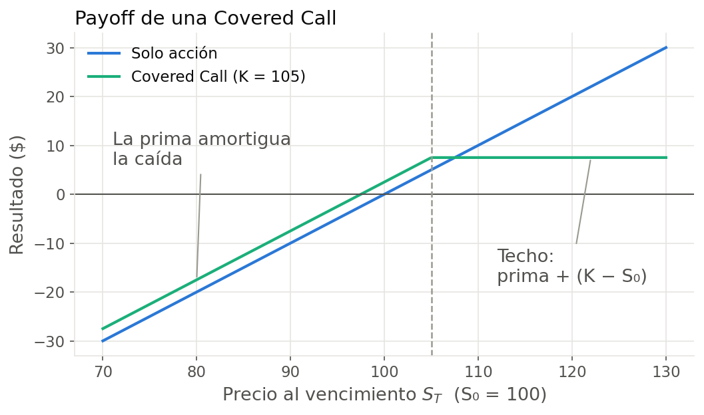
*Covered call: se cobra una prima a cambio de resignar la suba por encima del strike K. Ganancia máxima = prima + (K − S₀).*

**Índice**

- **Backtest (`poster/src/`):** 1 a 12
- **Fase 1 (`src/`):** 13 a 19
- **Estructura del proyecto:** 20 y 21
- **Resumen:** qué correcciones cambian conclusiones y cuáles no

---

## Parte A — Backtest (`poster/src/`)

### 1. La señal de venta comparaba contra la IV equivocada

**Problema.** El modelo vendía la call si σ̂ < VIX. Pero la call no se cotiza al nivel del VIX: el VIX resume toda la superficie de opciones de 30 días, incluidos los puts fuera del dinero, que son caros. La call que efectivamente se vende (ATM o algo OTM) cotiza a una IV mucho menor. La señal preguntaba "¿está cara la volatilidad?" cuando la pregunta correcta era "¿está cara *esta* call?".

**Corrección.** Se compara σ̂ con la IV de la call al strike que se va a vender, IV(K) = VIX · skew(x), observada en t0−1 (`strategy.py`, `Spec.signal = "strike"`). La versión original se conserva como "CC modelo (señal VIX)" para poder compararlas.

**Efecto.**

| | SPY | QQQ |
|---|---|---|
| VIX / VXN medio | 20,2% | 22,8% |
| IV media de la call vendida | **14,7%** | **16,7%** |
| Volatilidad realizada media | 16,3% | 19,7% |
| Meses con venta: señal VIX → señal corregida | 85% → **13%** | 78% → **9%** |
| Sharpe: señal VIX → señal corregida | 0,58 → **0,64** | 0,61 → **0,79** |
| Corregida contra señal VIX (pp/año, IC 95%) | +2,0 [+0,2; +4,0] | +5,4 [+3,0; +7,9] |

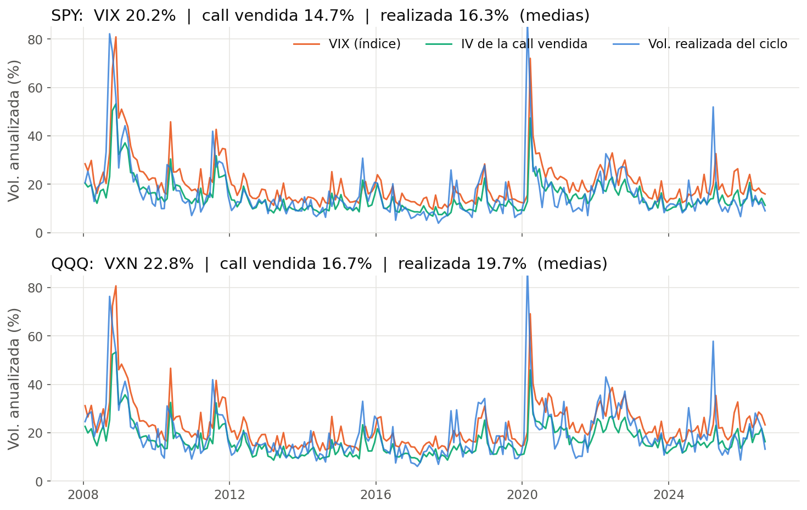
*La IV de la call vendida (verde) queda casi siempre por debajo de la volatilidad realizada (azul). El VIX (naranja) queda arriba: el margen entre VIX y realizada no existe para la call.*

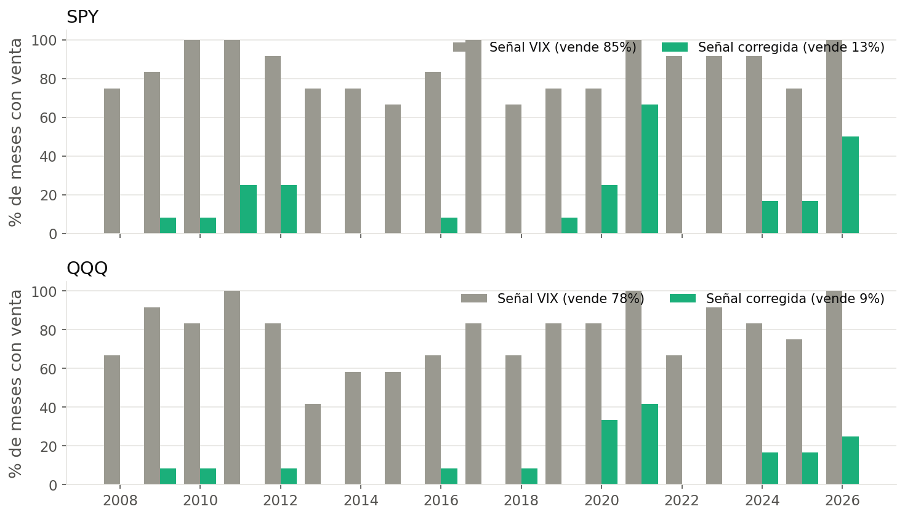
*Porcentaje de meses con venta por año. Con la señal original el modelo vendía casi siempre; con la corregida solo vende en períodos puntuales, sobre todo 2021 y 2026, cuando la volatilidad realizada fue muy baja.*

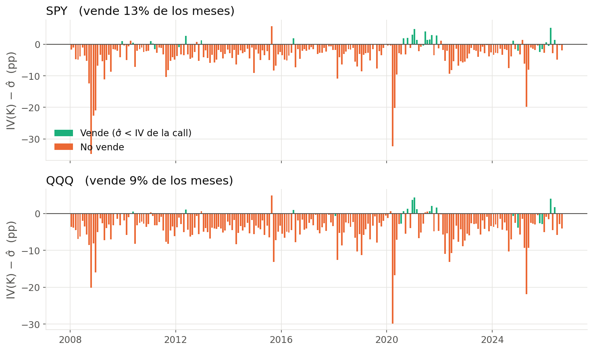
*Señal corregida por ciclo: IV de la call menos σ̂. Casi siempre es negativa, es decir, la call está barata respecto del pronóstico.*

**Conclusión.** Es la corrección más importante del proyecto: cambia el mensaje. La prima de riesgo de varianza que muestra el VIX (≈ 4 pp en SPY) no existe para las calls, que en promedio se venden *por debajo* de la volatilidad realizada. Con la comparación correcta, el modelo casi nunca vende y la estrategia converge a Buy & Hold. La hipótesis original ("vender cuando σ̂ < IV") era razonable; lo que fallaba era usar la IV del índice como si fuera la de la call.

---

### 2. Convención de tiempo: 252 ruedas contra 365 días

**Problema.** Las volatilidades realizadas y pronosticadas se anualizan con √252 (ruedas hábiles), pero el VIX se anualiza en base 365 días corridos. El código mezclaba ambas cosas:
- Black-Scholes usaba T = h/252 con una IV en base 365;
- la señal comparaba σ̂ (base 252) con el VIX (base 365) directamente;
- la calibración del skew usaba días corridos / 365.

**Corrección.** Cada cantidad se usa en su propia base y todas las comparaciones se hacen en **desvío por ciclo**:
- sd_modelo = σ̂ · √(h/252)
- sd_IV = IV · √(días corridos/365)

Black-Scholes usa T = días corridos / 365, coherente con la IV. Los ciclos guardan las dos duraciones (`h` y `cal`).

**Efecto.** Chico por ciclo (para 20 ruedas y 28 días, 20/252 = 0,079 contra 28/365 = 0,077), pero sistemático, porque afecta la prima de todos los ciclos y el umbral de la señal. No se aisló por separado: se aplicó junto con el skew (#3).

*Sin gráfico: es una convención de cálculo y su efecto está incluido en el del skew (#3).*

**Conclusión.** No cambia conclusiones, pero era una inconsistencia que un evaluador puede señalar. Ahora toda comparación entre volatilidad pronosticada e implícita está bien definida.

---

### 3. Calibración del skew

**Problema.** La curva IV(K)/VIX = 0,88 − 4,33·ln(K/S) estaba fija en el código, y su calibración en el notebook tenía varias inconsistencias:
- se calibró con T en días corridos y se aplicaba con T en días hábiles;
- el rendimiento por dividendo estaba fijo en 1,1%;
- usaba trades de cualquier momento del día contra el cierre del subyacente;
- juntaba opciones de 20 a 70 días;
- la recta se ajustó con ln(K/S) entre −2% y +6% pero se aplicaba fuera de ese rango (en crisis, hasta ~11%), donde el factor caía al piso de 0,5. Era extrapolación pura.

**Corrección** (`calibrate_skew` en `strategy.py`, se recalibra en cada corrida):
- **Calls de SPX:** opciones europeas, por lo que Black-Scholes es exacto, y es el índice sobre el que se calcula el VIX.
- **Muestra:** 20–45 días al vencimiento, volumen ≥ 10 y solo trades de la sesión de la tarde, para acercar el precio de la opción al cierre del subyacente.
- **Mismas convenciones que el backtest:** T en días corridos, tasa continua y dividendo de 12 meses por fecha.
- **Moneyness estandarizada:** x = ln(K/S)/(VIX·√T), que mide la distancia al strike en desvíos. La misma curva vale para distintos plazos y niveles de volatilidad.
- **Extrapolación plana** fuera del rango calibrado (percentiles 2–98).

**Efecto.**
- **SPX** (821 opciones): IV(K)/VIX = **0,83 − 0,18·x**.
- **Chequeo con calls de SPY** (1.226 opciones): 0,84 − 0,19·x. Prácticamente idéntico.
- **ATM:** la IV es 0,83×VIX (antes 0,88).
- **Strike típico del modelo** (x ≈ 0,4): factor ≈ 0,76, parecido al anterior.

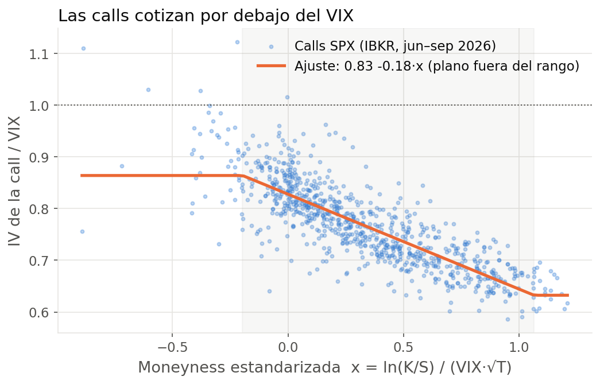
*Cada punto es una call de SPX. La IV relativa al VIX cae a medida que el strike se aleja hacia arriba. La recta naranja es la curva usada en el backtest, plana fuera de la zona gris (rango calibrado).*

**Conclusión.** La curva es robusta: dos subyacentes distintos dan casi la misma recta. Sigue siendo el supuesto del que más dependen los resultados (sin skew se invierte la conclusión: Sharpe del CC estático 0,74 contra 0,63 del Buy & Hold en SPY), pero ahora está calibrado de forma consistente y validado contra un ETF real (ver #11). La limitación que persiste es que se calibró en un único período de volatilidad baja (jun–sep 2026).

---

### 4. Ejercicio anticipado antes del dividendo

**Problema.** Las opciones sobre SPY y QQQ son americanas. Cuando una call está en el dinero la víspera de un ex-dividendo y el dividendo supera su valor temporal, al comprador le conviene ejercerla: se lleva la acción y el dividendo, y quien vendió la call lo pierde. El backtest trataba las calls como europeas.

**Corrección.** La rueda previa a cada ex-dividendo, si S − K > C_europea(S − D, K, τ), se asume ejercicio: las acciones se entregan a K, el efectivo rinde la tasa libre de riesgo hasta el vencimiento y se pierde el dividendo (`_early_exercise` en `strategy.py`). El parámetro `early_exercise=False` permite simular opciones europeas.

**Efecto.**
- **CC estático ATM sobre SPY:** 49 ejercicios en 224 ciclos. Cuesta **~1,1 pp/año** (CAGR 6,3% como europea contra 5,2% como americana).
- **CC siempre OTM:** 31 ejercicios en SPY y 16 en QQQ.
- **CC modelo:** 2 en SPY y 0 en QQQ, porque casi no vende.

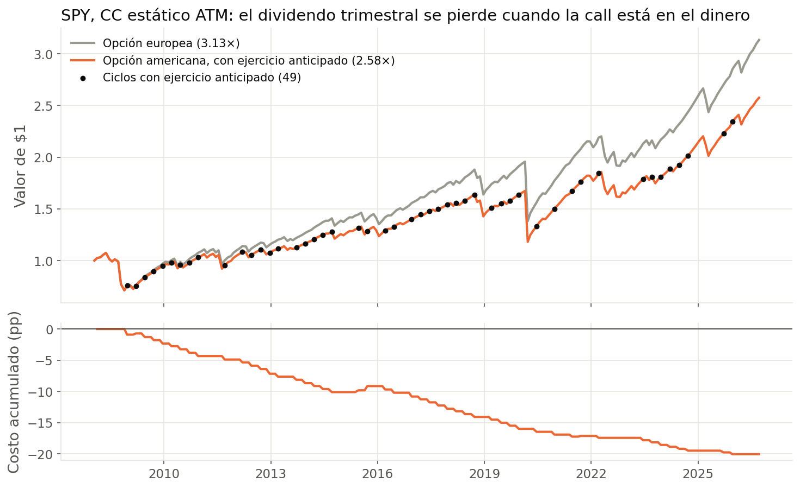
*CC estático ATM sobre SPY. Los puntos negros marcan los 49 ciclos con ejercicio anticipado, casi uno por trimestre. El costo acumulado llega a ~20 pp en 18 años.*

**Conclusión.** No es un detalle: SPY paga dividendo trimestral justo en la semana del vencimiento estándar (tercer viernes de marzo, junio, septiembre y diciembre), así que una covered call ATM sobre SPY pierde buena parte de esos dividendos. Agrava la conclusión principal: vender calls sobre SPY rinde todavía menos de lo que sugería la versión anterior. Hacerlo con opciones europeas de SPX evita este costo.

---

### 5. Drawdown medido con datos mensuales

**Problema.** El MaxDD se calculaba sobre la curva de equity mensual, es decir, solo mirando los días de vencimiento. Las caídas dentro del mes quedaban invisibles.

**Corrección.** `daily_equity` reconstruye el valor diario de cada estrategia marcando la call a mercado (Black-Scholes con la IV diaria y el skew). Un test verifica que el valor diario al vencimiento coincide exactamente con la equity por ciclos.

**Efecto.**

| MaxDD | Mensual (antes) | Diario (ahora) |
|---|---|---|
| SPY Buy & Hold | −45% | **−51%** |
| SPY CC estático ATM | −34% | −38% |
| QQQ Buy & Hold | −47% | **−49%** |
| QQQ CC estático ATM | −38% | −41% |

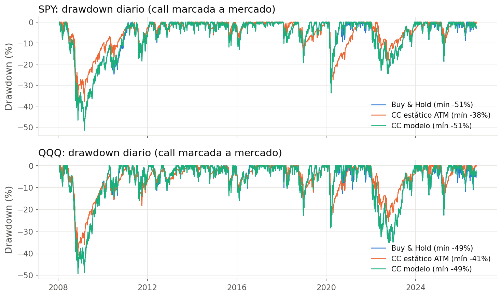
*Drawdown diario con la call marcada a mercado. Los pisos de 2008–2009 llegan a −51% en SPY y −49% en QQQ, más profundos de lo que mostraba la medición mensual.*

**Conclusión.** El riesgo de cola estaba subestimado en 2–6 pp. No cambia el ranking de estrategias, pero cualquier afirmación sobre "protección en crashes" tiene que apoyarse en el drawdown diario. La covered call amortigua algo la caída (−38% contra −51% en SPY), pero a cambio de 6,7 pp/año menos de CAGR.

---

### 6. Sharpe calculado mal y falta de Sortino

**Problema.** El Sharpe dividía el exceso medio por el desvío de los retornos *brutos* en lugar del de los excesos. Además, en estrategias con asimetría negativa como vender opciones, el Sharpe no distingue entre volatilidad buena y mala.

**Corrección.** Sharpe = media(exceso)/desvío(exceso). Se agrega el Sortino (exceso medio sobre el desvío a la baja).

**Efecto.**
- **Sharpe:** a dos decimales no cambia, porque la tasa libre de riesgo casi no tiene varianza.
- **Sortino:** amplía la brecha. En SPY, Buy & Hold 0,88 contra 0,41 del CC estático ATM. En QQQ, 1,17 contra 0,42.

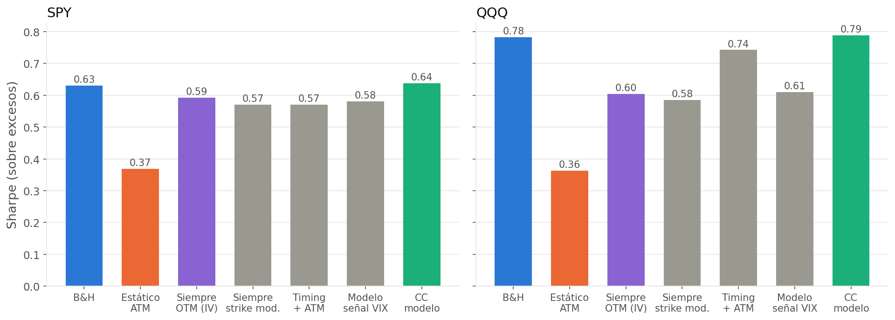
*Sharpe sobre excesos de todas las estrategias. Ninguna covered call supera al Buy & Hold. Las que venden siempre quedan claramente abajo.*

**Conclusión.** Era un error de fórmula sin impacto práctico, pero era incorrecto. El Sortino confirma que las covered calls no mejoran el perfil de riesgo a la baja en proporción a lo que resignan.

---

### 7. Sobreajuste: PSR y Deflated Sharpe

**Problema.** Se habían probado varias configuraciones (modelos, z, márgenes) y se reportaba el resultado de una sola, sin corregir por la cantidad de pruebas. El PSR se calculaba sobre retornos brutos y no se usaba en ningún lado. La consigna pedía Deflated Sharpe y no estaba.

**Corrección.**
- **PSR:** se calcula sobre excesos.
- **Deflated Sharpe:** contra el máximo Sharpe esperado entre las **36 configuraciones** probadas (6 pronósticos × 3 valores de z × 2 señales).
- **PSR del retorno activo:** el retorno del modelo menos el del Buy & Hold, para medir si le gana al Buy & Hold.

**Efecto.**

| | SPY | QQQ |
|---|---|---|
| DSR del CC modelo | 0,96 | 0,99 |
| PSR del retorno activo contra Buy & Hold | **0,50** | **0,45** |

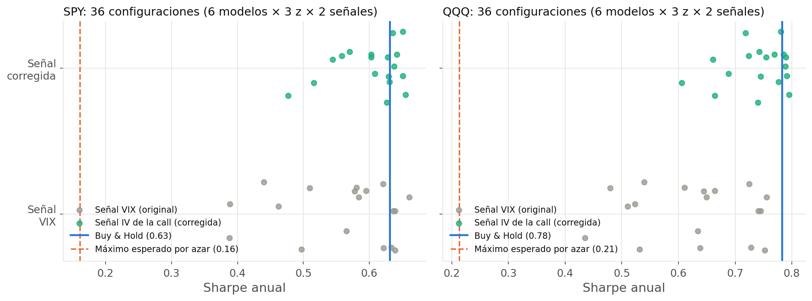
*Cada punto es una de las 36 configuraciones probadas. Las corregidas (verde) se agrupan alrededor del Buy & Hold (línea azul) y ninguna lo supera de forma clara. La línea punteada es el Sharpe máximo esperable por azar entre 36 pruebas.*

**Conclusión.** El Sharpe del modelo es "real" (DSR alto), pero porque copia al Buy & Hold. La probabilidad de que le gane al Buy & Hold es la de una moneda (0,50 y 0,45). Ninguna de las 36 configuraciones justifica afirmar que el modelo agrega valor sobre comprar y mantener.

---

### 8. Comparación contra un rival débil

**Problema.** La conclusión "el modelo le gana al CC estático" comparaba un CC con strike OTM y timing contra un CC **ATM**, que es el peor caso en un mercado alcista. Era imposible separar cuánto aportaba el modelo y cuánto el simple hecho de vender más lejos del dinero.

**Corrección.** Se agrega el rival **"CC siempre OTM (IV)"**: vende siempre, con la misma fórmula de strike pero usando la volatilidad implícita en lugar de σ̂, sin ningún modelo. El bootstrap compara el modelo contra cada alternativa.

**Efecto.** CC modelo menos cada alternativa, en pp/año (IC 95%):

| Contra | SPY | QQQ |
|---|---|---|
| CC estático ATM | +7,2 [+3,4; +11,0] | +11,9 [+7,3; +16,8] |
| CC siempre OTM (IV) | +2,5 [+0,2; +5,0] | +6,5 [+3,6; +9,6] |
| Buy & Hold | +0,0 [−0,8; +0,7] | −0,1 [−1,1; +0,8] |

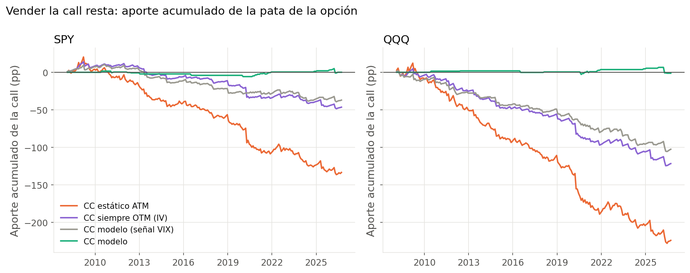
*Aporte acumulado de la call (estrategia menos Buy & Hold). Todas las variantes que venden seguido pierden plata de forma sostenida; el CC modelo corregido queda cerca de cero porque casi no vende.*

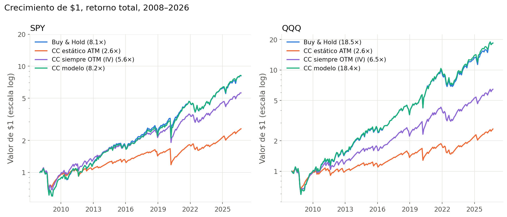
*Crecimiento de $1. El CC modelo se superpone con el Buy & Hold, y el rival justo (siempre OTM, violeta) queda claramente abajo.*

**Conclusión.** La ventaja contra el CC estático ATM (+7 a +12 pp) exageraba el mérito del modelo. Contra el rival justo, la ventaja es menor pero significativa. Su origen es claro: el modelo gana porque **deja de vender** algo que pierde plata, no porque elija mejores momentos para vender.

---

### 9. Tasa libre de riesgo

**Problema.** ^IRX cotiza la letra del Tesoro a 13 semanas como **tasa de descuento** (base 360), y se usaba directamente como tasa continua en Black-Scholes y en la capitalización de la prima. Además, el `bfill()` rellenaba los primeros días faltantes con valores futuros.

**Corrección.** Conversión exacta: precio = 1 − d·91/360 y r = −ln(precio)/(91/365) (`discount_to_continuous` en `data.py`, con su test). Se eliminó el `bfill`; si falta la tasa al inicio, el pipeline falla en lugar de inventarla.

**Efecto.** Con una tasa de descuento de 5%, la tasa continua es ≈ 5,1%. En 2008–2026, con tasas mayormente bajas, el impacto en primas y retornos es de pocos puntos básicos.

*Sin gráfico: el efecto es de pocos puntos básicos.*

**Conclusión.** Impacto despreciable en los resultados, pero la fórmula ahora es correcta y no hay ningún relleno con datos futuros.

---

### 10. EWMA con el λ de horizonte diario

**Problema.** El EWMA usaba λ = 0,94, el valor que RiskMetrics recomienda para pronosticar a **1 día**. Acá se pronostica la volatilidad de un ciclo de ~1 mes.

**Corrección.** λ = 0,97, el valor de RiskMetrics para horizonte mensual. Se recalcularon todos los pronósticos.

**Efecto.** El QLIKE del EWMA quedó prácticamente igual: SPY 0,66 → 0,666 y QQQ 0,46 → 0,458. Sigue siendo el segundo peor modelo, solo mejor que el rolling de 21 días.

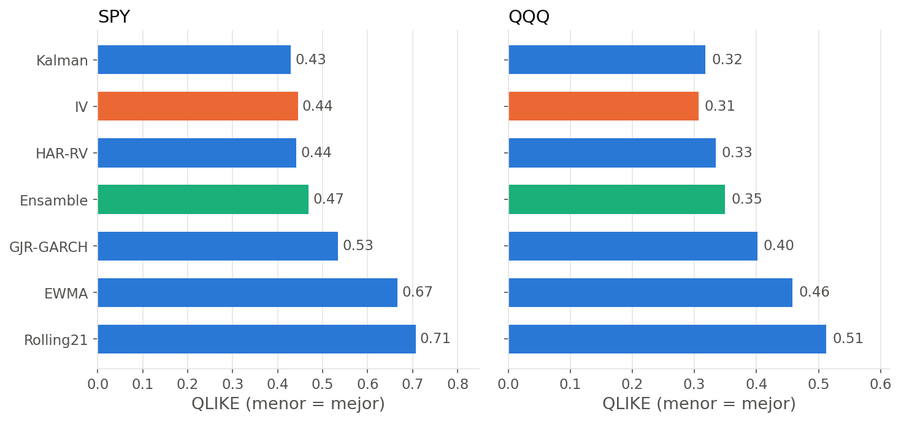
*Error de pronóstico fuera de muestra (QLIKE, menor es mejor). El EWMA sigue entre los peores modelos incluso con λ = 0,97; el Kalman es el mejor modelo propio y empata con la IV.*

**Conclusión.** Corrección de consistencia sin impacto. El EWMA es débil para este horizonte con cualquier λ razonable, porque no tiene reversión a la media (su pronóstico es plano).

---

### 11. Validación contra el ETF real (PBP)

**Problema.** El CC estático simulado se comparaba contra el ETF PBP (Invesco S&P 500 BuyWrite, que replica el índice BXM), pero:
- el BXM usa calls **europeas** de SPX, mientras la simulación usaba calls de SPY;
- no se consideraba la comisión del ETF (0,75%/año);
- la validación no figuraba en los resultados.

**Corrección.** El CC estático ATM se simula como opción europea (`early_exercise=False`) y se compara contra el retorno de PBP antes y después de comisiones. Entra en `results.json` y en el gráfico `10_validacion_pbp.png`.

**Efecto.**

| CAGR 2008–2026 | |
|---|---|
| Simulación anterior (skew viejo) | 7,7% |
| **Simulación corregida, opción europea** | **6,3%** |
| PBP antes de comisiones | 6,6% |
| PBP neto (real) | 5,9% |
| Correlación mensual simulación–PBP | 0,97 |

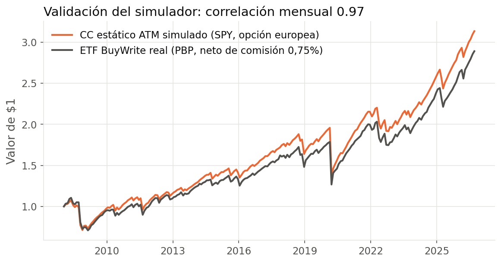
*CC estático simulado (opción europea) contra el ETF real PBP. Las curvas se mueven juntas (correlación 0,97); la brecha final corresponde a la comisión del ETF y a costos reales de operación.*

**Conclusión.** La simulación anterior era **optimista** en ~1,1 pp/año respecto del mercado real. La corregida queda a 0,3 pp, dentro de lo esperable por costos de transacción reales. Es la mejor evidencia de que el skew y el pricing son razonables, y la defensa principal frente a la objeción "sin skew el resultado se invierte".

---

### 12. Dependencia innecesaria de `yfinance`

**Problema.** `_yf()` importaba `yfinance` antes de chequear si el dato ya estaba en el cache local, así que el pipeline no corría sin esa librería aunque todos los datos estuvieran guardados.

**Corrección.** El import se hace solo si hay que descargar.

*Sin gráfico: es un cambio de código sin efecto en los números.*

**Conclusión.** Reproducibilidad: el backtest corre sin conexión y sin `yfinance`.

---

## Parte B — Fase 1 (`src/`)

### 13. GJR-GARCH: pronóstico congelado y feature con información futura

**Problema.** Había dos errores:
- **El walk-forward estaba roto.** Entre reajustes, pronosticaba siempre desde la fecha del último reajuste: el pronóstico quedaba **constante durante 21 días** sin incorporar los retornos nuevos.
- **La feature miraba el futuro.** El pipeline no usaba esa función, sino el ajuste **in-sample** con toda la muestra. La volatilidad condicional de 2010 se calculaba con parámetros estimados con datos hasta 2026. El docstring decía "sin lookahead bias".

**Corrección.** Los parámetros se reestiman cada 21 ruedas con ventana expansiva (datos hasta t−1), y entre reajustes la varianza se actualiza **todos los días** con la recursión GJR y el retorno de ayer. La feature usa este pronóstico. El ajuste in-sample queda solo para reportar parámetros, documentado como descriptivo. Un test verifica que el pronóstico de t no cambia si se altera el futuro y que varía entre reajustes.

**Efecto.**
- **QLIKE a 1 día en SPY:** walk-forward 1,530 contra in-sample 1,524.
- **Parámetros in-sample de SPY:** α ≈ 0, γ = 0,25, β = 0,86. El efecto leverage domina por completo: solo los shocks negativos suben la volatilidad. Ver `fase1_garch_walkforward.png`.

*Detalle 2019–2021. Las dos curvas casi coinciden: la diferencia no es visual sino de principio, porque la gris usa parámetros estimados con datos hasta 2026. Lo que no se ve es el error anterior, el pronóstico congelado 21 días, que ya no existe en la verde.*

**Conclusión.** El in-sample parece un poco mejor *precisamente* porque usa información futura; esa diferencia es la ventaja ilegítima que se eliminó. Como feature para un modelo predictivo, solo el pronóstico walk-forward es válido.

---

### 14. Prima de varianza con Garman-Klass

**Problema.** La prima ex-ante se calculaba como VIX − volatilidad Garman-Klass de 21 días. Garman-Klass usa solo precios dentro del día (apertura, máximo, mínimo, cierre) e ignora el salto entre el cierre y la apertura siguiente. En SPY, la varianza close-to-close es **1,52 veces** la de Garman-Klass: la volatilidad quedaba subestimada ~19% y la prima, inflada.

**Corrección.** Se usa Yang-Zhang, que incorpora el gap overnight y ya estaba implementado. La columna pasa a llamarse `vrp_vix_minus_spy_yz`. Las versiones con GARCH usan el pronóstico walk-forward (#13).

**Efecto.** Prima media de SPY: **6,6 pp con Garman-Klass contra 3,2 pp con Yang-Zhang** (`fase1_vrp_gk_vs_yz.png`). En 2008–2009 y en 2020, la prima corregida llega a ser **negativa**.

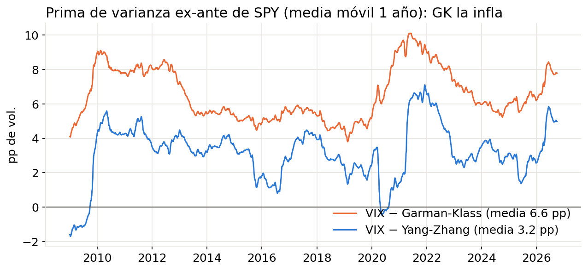
*Prima de varianza ex-ante de SPY (media móvil de un año). Con Garman-Klass (naranja) la prima es sistemáticamente el doble que con Yang-Zhang (azul), y nunca se vuelve negativa en 2008 ni en 2020.*

**Conclusión.** La versión anterior duplicaba la prima de riesgo de varianza, un error que empujaba a creer que vender volatilidad era más rentable de lo que es. Combinado con #1, explica buena parte del optimismo original del proyecto.

---

### 15. Filtro de Kalman con parámetros a mano y varianza de toda la muestra

**Problema.**
- **Parámetros a mano:** la varianza del estado q estaba fijada sin justificación (1e−5).
- **Información futura:** la varianza del ruido r era 0,5 × la varianza de *toda* la serie.
- **Inconsistencia:** el backtest estimaba el Kalman por máxima verosimilitud, así que había dos criterios distintos en el mismo proyecto.
- **Nombre engañoso:** el ratio ln(VIX)/ln(VIX3M) se presentaba como "cointegración" sin ningún test.

**Corrección.** Un único filtro genérico (`_filter`) para los casos 1D y 2D. Si no se pasan q y r, se estiman por **máxima verosimilitud usando solo el primer año** (`fit_window = 252`) y después el filtro corre hacia adelante. El docstring aclara que es un ratio dinámico, no un test de cointegración. Un test verifica que los estados no cambian si se altera el futuro.

**Efecto.** En VIX/VIX3M la verosimilitud elige q = 8,4e−5 y r = 1,9e−4. La varianza del estado es ~8 veces la que estaba fijada a mano (el beta se mueve ~3 veces más rápido).

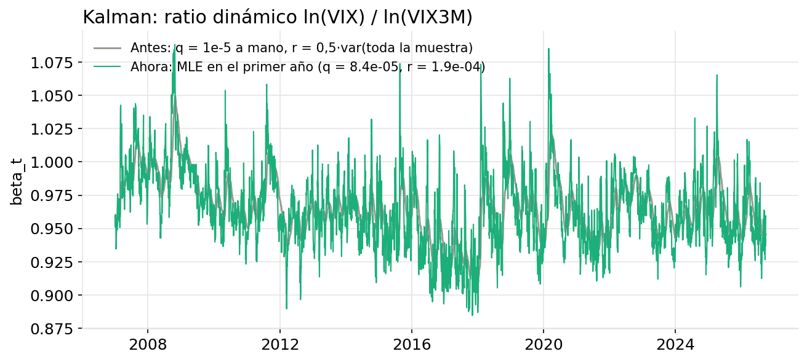
*Ratio dinámico ln(VIX)/ln(VIX3M). Con los parámetros a mano (gris) el filtro es lento y suavizado; con los estimados por verosimilitud (verde) sigue los saltos de la estructura temporal del VIX.*

**Conclusión.** El grado de suavizado ahora lo decide la verosimilitud con datos pasados, igual que en el backtest. El q a mano hacía al filtro demasiado lento para seguir los cambios de la estructura temporal del VIX.

---

### 16. Ornstein-Uhlenbeck: ventana corta, sesgo y regímenes

**Problema.**
- **Ventana corta y sesgo:** el AR(1) se estimaba por mínimos cuadrados con ventanas de **60 días**. Ese estimador de b está sesgado hacia abajo en muestras chicas (sesgo de Kendall ≈ −(1+3b)/n), lo que subestima la persistencia y el half-life.
- **Regímenes:** los cortes del s-score (−1; 0,5; 2) no coincidían con los de la consigna (0 y 2).

**Corrección.** Ventana de 252 ruedas, corrección b_adj = b + (1+3b)/n con el intercepto recalculado, y regímenes calma (s < 0), alerta (0 ≤ s < 2) y estrés extremo (s ≥ 2). Hay tests de que recupera los parámetros en datos simulados y de que la corrección reduce el sesgo.

**Efecto.** Half-life mediano del spread ln(VIX) − ln(VIX3M):

| | Mínimos cuadrados | Corregido |
|---|---|---|
| Ventana 60 (antes) | **3,8 ruedas** | 6,1 |
| Ventana 252 (ahora) | 5,9 | **6,9 ruedas** |

(Medianas con una estimación cada 20 ruedas; el gráfico estima cada 5 ruedas y da 3,7 y 6,8.)

Distribución de días por régimen: calma 58%, alerta 39%, estrés extremo 3,4% (`fase1_ou_sscore.png`).

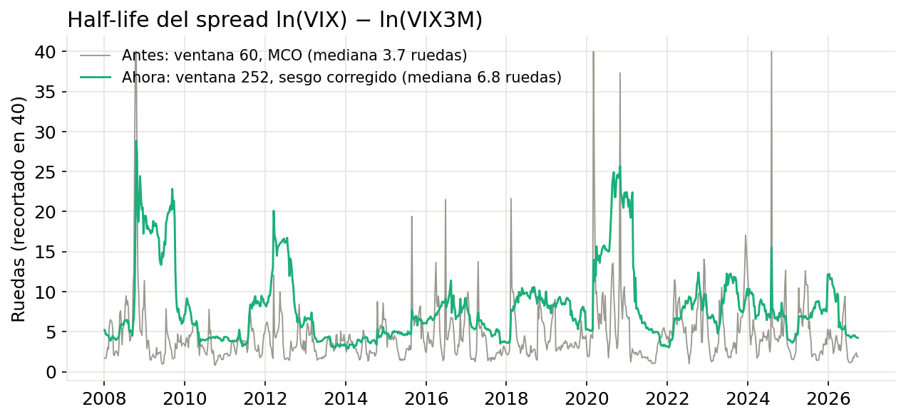
*Half-life rodante del spread. La versión anterior (gris) es más baja y muy ruidosa; la corregida (verde) es estable y sube en las crisis (2008, 2012, 2020), cuando la estructura temporal tarda más en normalizarse.*

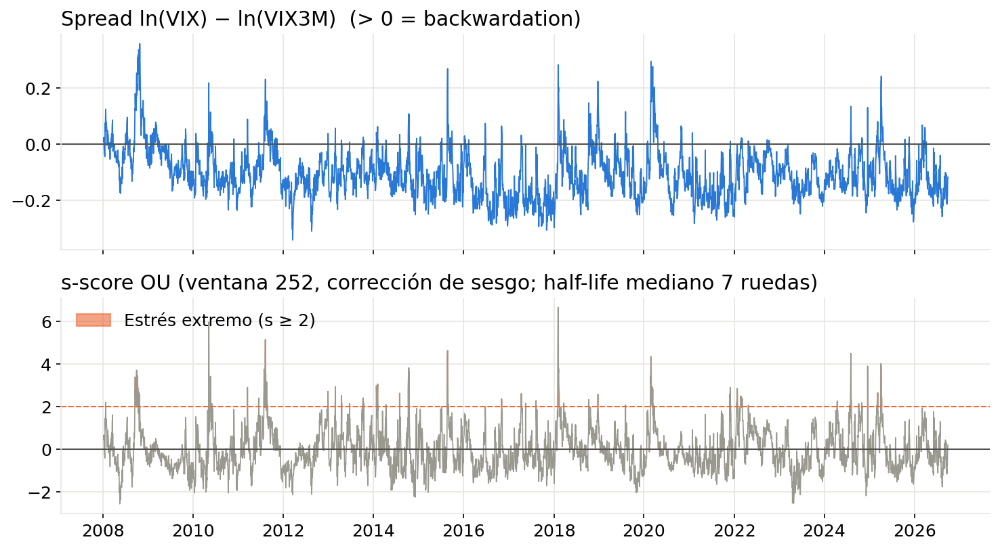
*Spread ln(VIX) − ln(VIX3M) y s-score con los regímenes corregidos. El estrés extremo (s ≥ 2) aparece solo en episodios puntuales: 3,4% de los días.*

**Conclusión.** La versión anterior subestimaba el half-life a casi la mitad. Para una estrategia que use el s-score como señal, eso significa esperar una reversión a la media el doble de rápida de lo real, con salidas prematuras.

---

### 17. Diferenciación fraccionaria

**Problema.**
- **Precio en nivel:** se aplicaba al precio y no a su logaritmo.
- **Información futura:** el orden d* se elegía con un test ADF sobre **toda la muestra** y después se usaba como feature.
- **Faltaba KPSS,** que la consigna pide.
- **Criterio frágil:** el p-valor de ADF no es monótono en d; tomar el primer rechazo puede caer en un d aislado.

**Corrección.**
- **Log-precio:** la técnica se aplica sobre el logaritmo.
- **Sin información futura:** d* se elige solo con 2007–2014 (`train_end`).
- **Criterio robusto:** el menor d a partir del cual ADF rechaza para ese d *y todos los mayores*.
- **KPSS como diagnóstico.**

Se evaluó exigir también que KPSS no rechace, pero en SPY y QQQ eso deja d* = 1 (KPSS rechaza para todo d < 1), lo que anula la técnica. Por eso KPSS quedó como diagnóstico. Un test verifica que d = 1 reproduce la primera diferencia.

**Efecto.**

| | d* antes | d* ahora | Correlación con el nivel | ¿KPSS acepta algún d < 1? |
|---|---|---|---|---|
| SPY | 0,60 | **0,50** | 0,67 | No |
| QQQ | 0,60 | **0,50** | 0,71 | No |
| NVDA | 0,70 | **0,10** | 0,99 | Sí |

*Diagnóstico por d en el período de entrenamiento. En SPY, KPSS (naranja) rechaza para todo d < 1, y al d* = 0,5 la correlación con el nivel (verde) ya cayó a 0,67. En NVDA, ADF acepta desde d = 0,1 con correlación 0,99, pero KPSS recién acepta desde d = 0,6.*

**Conclusión.** Para SPY y QQQ la técnica no cumple su promesa: con d ≈ 0,5 la correlación con el nivel cae a ~0,7 (lejos del > 0,9 que pide la consigna) y KPSS sigue rechazando. En NVDA sí funciona (d = 0,1 con correlación 0,99). Si se usan estas features, hay que reportar esta limitación.

---

### 18. Descarga de datos con relleno hacia atrás

**Problema.** `download_market_data.py` aplicaba `bfill()` después de `ffill()`: si una serie empezaba más tarde, sus primeros días se rellenaban con el primer valor *futuro*. El README decía que solo se usaba `ffill`.

**Corrección.** Solo `ffill()` y después `dropna()`, en los dos paneles que genera el script.

**Efecto.** Se verificó que en el panel actual ninguna serie tiene un arranque rellenado (ninguna columna empieza con valores repetidos), así que los datos existentes no cambian.

*Sin gráfico: en los datos actuales el cambio no modifica ningún valor.*

**Conclusión.** Fue preventiva: con los tickers actuales no había daño, pero con un activo que empiece a cotizar después de la fecha de inicio el error habría aparecido sin aviso.

---

### 19. Archivo de features desactualizado

**Problema.** `data/features_phase1.parquet` cubría de 2020-03 a 2026-09, mientras que el panel del que sale arranca en 2007. Se había generado con una versión anterior del panel y no se volvió a correr.

**Corrección.** Se regeneró con todas las correcciones anteriores.

**Efecto.** Ahora cubre **2008-01 a 2026-09** (4.716 filas × 55 columnas). Incluye la crisis de 2008, que antes faltaba.

*Sin gráfico propio: todos los gráficos de la fase 1 de este documento usan el archivo regenerado.*

**Conclusión.** Cualquier análisis hecho con el archivo anterior dejaba afuera la crisis financiera, justo el período más informativo para modelos de régimen y de volatilidad.

---

## Parte C — Estructura del proyecto

### 20. Tests que no testeaban

**Problema.** `src/test_phase1.py` no tenía ninguna verificación: imprimía valores y al final "TODOS LOS TESTS PASARON" pase lo que pase.

**Corrección.** Se reemplazó por `tests/test_core.py`, con **13 tests** con aserciones (`python -m pytest tests -q`):
- **Fórmulas:** Black-Scholes contra el ejemplo 15.6 de Hull (c = 4,76), inversión de IV, conversión de la tasa de descuento, skew plano fuera de rango y estimadores de rango positivos.
- **Modelos:** recuperación de parámetros OU, efecto de la corrección de sesgo y diferenciación fraccionaria con d = 1 igual a la primera diferencia.
- **Causalidad:** GARCH (y que se actualice entre reajustes), Kalman 1D y 2D, y los pronósticos del backtest.
- **Consistencia del backtest:** CC estático igual a z = 0, y equity diaria igual a la equity por ciclos.

*Sin gráfico: ver la lista de tests.*

**Conclusión.** Varios de los errores de este documento (#13, #15, #17) se habrían detectado con un test de causalidad. Ahora cada cambio futuro se puede verificar en segundos.

---

### 21. Documentación

**Problema.** El README describía un proyecto anterior: solo la descarga de datos, desde 2020, sin backtest ni resultados.

**Corrección.** README nuevo con la estructura real, los comandos para reproducir todo y las convenciones del backtest (tiempos, skew, señal, ejercicio anticipado, tasa).

*Sin gráfico.*

**Conclusión.** El proyecto ahora se puede reproducir de punta a punta desde el README. Queda pendiente decidir qué hacer con los archivos del póster anterior (`poster/overleaf/`, `poster/notebooks/`, `make_notebook.py`, `tex_numbers.py`), que siguen con los números viejos.

---

## Resumen: qué correcciones cambian conclusiones y cuáles no

| # | Corrección | ¿Cambia conclusiones? |
|---|---|---|
| 1 | Señal contra la IV de la call | **Sí, la principal.** El modelo pasa de vender 85% a 13% de los meses en SPY y converge a Buy & Hold |
| 14 | Prima de varianza con Yang-Zhang | **Sí.** La prima de la fase 1 era el doble de la real |
| 8 | Rival justo (siempre OTM) | **Sí.** La ventaja del modelo era mucho menor de lo reportado y viene de no vender |
| 4 | Ejercicio anticipado | **Sí, en magnitud.** −1,1 pp/año al CC ATM sobre SPY |
| 3, 11 | Skew y validación con PBP | **Sí, en confianza.** El simulador pasa de optimista a calibrado contra el mercado real |
| 7 | PSR / Deflated Sharpe | **Sí, en interpretación.** No hay evidencia de que el modelo le gane al Buy & Hold |
| 5 | MaxDD diario | Parcial: el riesgo de cola era 2–6 pp mayor |
| 13, 15, 16, 17 | GARCH, Kalman, OU, fracdiff | Sí para la fase 1 (información futura, half-life, d*); no afectan al backtest |
| 2, 6, 9, 10, 12, 18 | Tiempo, Sharpe, tasa, EWMA, yfinance, bfill | No: errores de fórmula o de consistencia con impacto despreciable |
| 19, 20, 21 | Features, tests, README | No cambian números; hacen el proyecto confiable y reproducible |

**Conclusión general.** Varios errores chicos empujaban todos en la misma dirección: hacían que vender calls pareciera más rentable de lo que es. Los principales eran la señal contra el VIX, la prima inflada por Garman-Klass, el rival débil, el ejercicio anticipado ignorado y el drawdown mensual. Corregidos, la conclusión cambia de "el modelo le gana al covered call estático" a una más sólida y defendible: **la prima de volatilidad está en los puts, no en las calls; vender calls sobre índices destruye valor, y un buen pronóstico de volatilidad sirve para saber cuándo no venderlas.**
